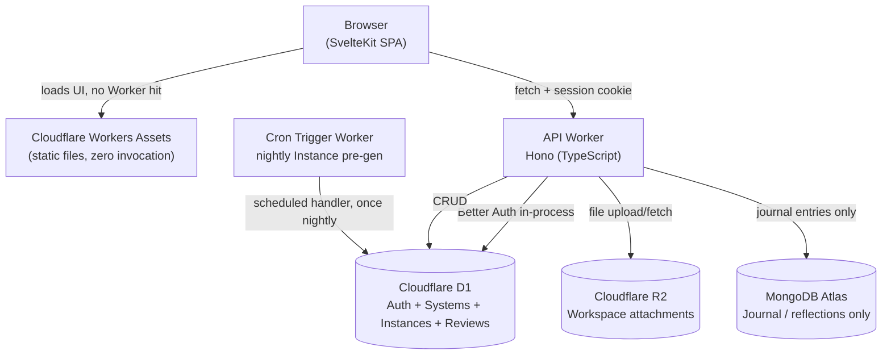

# Tech Stack & Architecture Decision Record (ARD)

**Project:** *Polaris*

**Document type:** Architecture Decision Record -- a companion to the product PRD, covering technology choices, rationale, and component roles (not feature scope or schema, which live in the PRD).

**Implementation status:** Planned / Target Architecture

**Status:** Draft -- MVP architecture

**Last updated:** June 30, 2026

---

## 1. Purpose

This document records what the stack is, why each piece was chosen over the alternatives that were considered, and what role each piece plays in the running system. It exists so the reasoning behind the stack survives independently of any one conversation or sprint.

## 2. Guiding Constraints

Four constraints shaped every decision below, in this order of priority:

1. **10ms CPU per request.** Cloudflare Workers free tier caps CPU time at 10ms per invocation (I/O wait excluded). Every server-side computation -- route handler, Cron trigger, middleware -- must fit within this budget. This is the single most restrictive constraint on the architecture and overrides all other concerns when there's a conflict.
2. **Free.** This is a passion project -- the stack needs to run on free tiers indefinitely, not "free while small."
3. **Ship it.** A working MVP matters more than a maximally ambitious one. The riskiest, least-proven pieces of the stack are not allowed to block the rest from shipping.
4. **Learn something new.** Within constraint #3, every layer was deliberately chosen to push into unfamiliar territory rather than default to the existing React/Next.js + FastAPI background.

These three pulled in different directions more than once -- see S6 (Rejected Alternatives) and S8 (Open Risks) for where that tension showed up and how it was resolved.

## 3. Stack at a Glance

| Layer | Choice | Role |
|---|---|---|
| Hosting platform | **Cloudflare** (Workers, D1, R2, Cron Triggers) | Single free platform for compute, data, storage, and scheduling -- all four are active v1 dependencies, not stretch goals |
| Frontend | **SvelteKit**, SSR disabled (CSR / SPA) | UI, served as static assets |
| Frontend interaction | **svelte-dnd-action** | Drag-and-drop for the Workspace Builder's widget canvas |
| Backend API | **Hono** (TypeScript)  | CRUD API between frontend and databases |
| Primary database | **Cloudflare D1** (SQLite) | Core structured data: Systems, Instances, Review entries |
| File storage | **Cloudflare R2** | Workspace attachments (e.g. source files, form-check photos) |
| Scheduled compute | **Cloudflare Cron Triggers** | Nightly Instance pre-generation -- see S5.8 |
| Message queue | **Cloudflare Queues** | MongoDB write retry for failed journal entries -- see S5.5 |
| AI inference | **Cloudflare Workers AI** | AI-assisted System creation (`@cf/deepseek-ai/deepseek-r1-distill-qwen-32b`) |
| Secondary database | **MongoDB Atlas** | One bounded, document-shaped feature only |
| Auth | **Better Auth** | Self-hosted email/password auth on D1 |
| Styling | Tailwind CSS | CSS Styles |

## 4. Architecture



Everything except MongoDB Atlas lives inside Cloudflare's network. Auth is also in-process -- Better Auth runs inside the same Worker as the API, sharing the same D1 database. The Cron Trigger handler can live in the same Worker script as the API (a `scheduled` export alongside `fetch`) -- it does not need to be a separate deployment.

## 5. Component Decisions

### 5.1 Hosting -- Cloudflare

**Why:** generous, genuinely free tiers across compute (Workers), database (D1), storage (R2), and scheduling (Cron Triggers) -- no other platform covers all four under one free account.
**Used for:** static asset hosting, API compute, the primary database, workspace file storage, and the nightly Instance pre-generation job. All four are in active v1 use -- see S5.7 and S5.8.

### 5.2 Frontend -- SvelteKit (CSR-only) + Tailwind CSS

**Why SvelteKit over Next.js:** Next.js/React is already known -- the goal here was new ground. SvelteKit's compiler-driven reactivity (no virtual DOM, far less boilerplate per route) is a genuine departure, and it has first-class, production-ready support on Cloudflare Workers.

**Why CSR instead of SSR:** Cloudflare's free Workers plan caps CPU time at 10ms per request (Constraint #1) -- but that only counts actual computation, not time spent waiting on I/O. Full-page SSR is one of the most common ways to burn that budget, which lines up with hitting "CPU limit exceeded" on past projects. Serving SvelteKit as pure static files means **zero Worker invocation for the frontend at all** -- it can't hit a CPU limit by definition.

**Why Tailwind CSS:** utility-first CSS framework that compiles to a small, scoped stylesheet (no runtime, no unused styles purged at build). Tailwind is the standard pairing with SvelteKit in 2026 -- it avoids the mental overhead of separate CSS files for each component while keeping styles co-located with markup. No CSS-in-JS runtime, no CSS modules convention to learn -- just inline utility classes that map directly to design tokens. The `tailwind.config.js` will define the custom color palette and spacing scale; all component styling stays in the Svelte files.

**Used for:** all UI -- dashboards, forms, and lists for Systems, Instances, and Review entries.

**Drag-and-drop dependency -- `svelte-dnd-action`:** the Workspace Builder (PRD S6.2) needs a drag-and-drop canvas for arranging widgets. `svelte-dnd-action` is the standard choice for Svelte -- it's framework-native (no React-shim libraries like `react-dnd` ported over), has no runtime dependencies beyond Svelte itself, and works with Svelte 5's reactivity model. It only governs widget *position and ordering* on the canvas (stored as the `layout` JSON blob on Workspace, PRD S5.4) -- it has no opinion on what a widget renders, which stays app-specific.

### 5.3 Backend API -- Hono (TypeScript)

**Why Hono:** purpose-built for the Workers runtime, no adapter layer, minimal overhead -- a natural fit for a thin CRUD API. TypeScript throughout keeps the stack uniform and allows type sharing with the SvelteKit frontend.

**Used for:** all authenticated CRUD endpoints, talking to D1, R2 (proxied uploads), Cloudflare Workers AI (AI-assist route), and MongoDB (journal feature only). Auth (Better Auth) runs in-process -- see S5.6. Also exports the `scheduled` handler for the nightly Cron Trigger (S5.8) -- one deployment covers both `fetch` and `scheduled` exports.

**Note:** `workers-rs` (Rust backend) was explored as a learning stretch in an earlier phase of planning. It is **not in scope for v1** and has been removed from the architecture. All backend code is TypeScript via Hono.

### 5.4 Primary database -- Cloudflare D1

**Why:** the core data (Systems, Instances, Review entries) is fixed, structured, relational -- exactly what SQL is built for. D1 sits inside the same edge network as the Worker (no extra network hop, no separate account), and its free tier (5 GB storage, 5M rows read/day, 100K rows written/day) is far beyond what a personal app will reach.

**Used for:** all core app data.

### 5.5 Secondary database -- MongoDB Atlas

**Why it's here at all:** an explicit, separate goal -- learning MongoDB/NoSQL patterns -- not a technical requirement of the app.

**Why it's bounded to one feature:** Atlas's HTTP Data API was deprecated and removed in September 2025; the remaining path is the raw TCP driver, which pays a fresh TCP+TLS handshake on every cold Worker invocation, with no connection pooling available for Mongo. That cost is acceptable for one non-critical-path feature -- it would be a real problem if it sat on every page load.

**Used for:** one genuinely document-shaped feature -- free-form journal / reflection entries -- and nothing else. The core schema stays on D1.

**Failure mode and retry strategy:** Atlas's TCP+TLS cold-start can fail transiently (network blip, cold Worker invocation with an unresolved Atlas hostname). Without a retry mechanism, a failed write silently drops the user's journal entry -- which violates the "capture beats perfection" principle directly. The solution is **Cloudflare Queues**:

1. User saves a journal/log entry -> Hono Worker attempts a direct MongoDB write.
2. If the write succeeds -> done, return 200 to client immediately.
3. If the write fails -> Worker enqueues the entry payload to a Cloudflare Queue and returns a `202 Accepted` to the client (entry is saved locally in the UI's optimistic state, user sees no error).
4. A Queue consumer Worker (can be the same Worker script via a `queue` export handler) dequeues and retries the MongoDB write. Queues provide automatic retries with exponential backoff -- if Atlas is persistently unreachable, the message retries up to the configured max attempts before going to the dead-letter queue.
5. The dead-letter queue is inspected manually; for a personal app this is a last resort, not a production alert system.

**Free-tier viability of Queues:** Cloudflare Queues free tier includes 10,000 operations/day. A journal entry enqueue + dequeue is 2 operations. Even if every single journal write failed and went through Queues (worst case), the personal-app volume of journal entries is nowhere near 5,000/day. This is well within the free tier.

Queues are added to the stack table in S3 as a new entry.

### 5.6 Auth -- Better Auth (self-hosted on D1)

**Why Better Auth instead of an external provider:** The decision evolved over time. ADR 001 originally selected Clerk, but the deployment reality changed the calculus -- Clerk production mode requires a custom domain, and Polaris runs on `*.workers.dev`. Development mode's 5-user limit and session wipes weren't acceptable. See [Auth Integration](../reference/auth-integration.md) for the full wiring detail.

Better Auth is an open-source, self-hosted auth library with native D1 support (no adapter packages needed). Key properties:

- **No external service** -- auth lives in-process inside the same Worker as the API, sharing the same D1 database. One deployment, one backup strategy, no network hop for session verification.
- **No domain requirement** -- works on `*.workers.dev` subdomains with no custom domain gate.
- **No usage ceiling** -- D1's free tier (5 GB) far exceeds what a personal auth table needs, and there's no per-user licensing cost.
- **Native Svelte 5 integration** -- `better-auth/svelte` provides runes-compatible stores (`authClient.useSession()`) that work directly with `$state`, `$effect`, and Svelte 5's reactivity model.
- **Cookie-based sessions** -- Better Auth manages HTTP-only session cookies with CSRF protection. The frontend uses `credentials: 'include'` on all API requests. Vite proxy in dev handles same-origin forwarding.

**What was given up vs. Clerk:**

- Sign-up/sign-in UI is hand-built (Clerk provides a hosted UI) -- form fields, validation, error handling, loading states are all custom.
- Password reset flow requires explicit configuration and UI (Clerk handled it automatically).
- Cookie-based auth is less friendly to API clients than Bearer JWTs.

### 5.7 File storage -- Cloudflare R2

**Why it's a v1 dependency, not deferred:** workspace widgets (Link list, Log entries) are expected to hold attachments -- a source PDF on a Study workspace, a form-check photo on a Health workspace. That's a real v1 use case, not a future one, so R2 is scoped in from the start rather than added later as a stretch.

**Why R2 over an external object store:** same reasoning as D1 -- same network, same account, no extra service to provision or pay for. Free tier (10 GB-month storage, 1M Class A operations/month, 10M Class B operations/month) is far beyond personal-app volume, and R2 has zero egress fees, which matters if attachments get viewed often (e.g. repeatedly opening a reference PDF).

**Upload flow -- proxied through the Worker:** R2's Workers binding (`env.R2_BUCKET.put(key, body)`) does not support presigned URLs in the same way as S3. Presigned URL generation requires enabling R2's S3-compatible API and issuing separate S3 credentials -- an added surface that's unnecessary for a single-user personal app. Instead, all file uploads are proxied directly through the Hono API Worker:

1. Frontend sends a `multipart/form-data` POST to `/api/attachments`.
2. Hono reads the file stream from the request body.
3. Hono calls `env.R2_BUCKET.put(key, stream)` with a generated key (`{system_id}/{widget_id}/{uuid}.{ext}`).
4. On success, Hono writes a pointer row to D1 (`r2_key`, `filename`, `content_type`, `size_bytes`, `widget_id`) and returns the pointer's `id` to the client.
5. For retrieval, the client requests `/api/attachments/{id}` and the Worker streams the R2 object back.

**Implication:** file bytes transit the Worker on upload. For a personal-use app with infrequent, small attachments (PDFs, photos), this is not a bottleneck. If large files become a use case, revisiting the S3-compatible presigned URL path is the right move at that point, not in v1.

**Orphaned object handling:** if the R2 write succeeds but the subsequent D1 pointer write fails, an orphaned R2 object exists with no DB reference. Mitigation: always write D1 *after* R2 confirms; if D1 fails, log the orphaned key for manual cleanup. At personal-app scale and R2's free-tier storage (10 GB), orphaned objects from transient D1 failures are a negligible concern -- no automated cleanup process is needed in v1.

**Bound:** attachments only. R2 is not used for application code, build artifacts, or database backups in v1 -- those stay out of scope until there's an actual need.

### 5.8 Scheduled compute -- Cron Triggers (nightly Instance pre-generation)

**What it does:** PRD S5.3 specifies that Instances (a day's occurrence of a System) auto-generate lazily when the dashboard loads. The PRD's open question (S13.1) asked whether to *also* run a nightly job so tomorrow's Instance is visible the night before, rather than only appearing once the user opens the app the next day.

**Decision: yes, add a nightly Cron Trigger.** It's a small, well-bounded addition and meaningfully improves the "Review Day at night, see tomorrow already queued" experience without adding real risk.

**Does it work on the free tier? Yes, comfortably,** for this specific workload:

- Cron Triggers are included on the Workers Free plan at no extra cost, with a limit of 5 triggers per account on Free (250 on Paid) -- one nightly job uses one slot, well inside that.
- As of 2026, Cron Triggers support a 1-minute minimum cadence -- once-a-day is far coarser than the floor, no constraint there.
- The job itself is cheap: query active Systems whose schedule matches "tomorrow," skip any that already have an Instance for that date (idempotency check), batch-insert the rest into D1. For a personal account with even a few dozen active Systems, this is a handful of D1 reads and writes -- nowhere close to the 10ms free-tier CPU budget per invocation (CPU time excludes time spent waiting on D1 I/O) or the 100K-requests/day cap (a scheduled invocation counts as one request).
- The handler can live as a `scheduled` export in the same Worker script as the API (Hono) -- no separate deployment, no separate billing surface.

**Known limitations to design around:**

- **UTC only, no per-user timezone.** Cron Triggers fire on UTC time. For this app, the user timezone is fixed as `Asia/Manila` (UTC+8, no DST -- see PRD S5.2). 11 PM Manila = 15:00 UTC, so the cron expression is `0 15 * * *`. Because the Philippines does not observe DST, this offset is permanent -- the cron expression never needs seasonal adjustment. This is one of the practical benefits of the Manila timezone decision.
- **No automatic retry on failure.** If the scheduled handler throws or exceeds its CPU budget, Cloudflare does not retry -- the next attempt is the next scheduled tick (24 hours later). Mitigation: the lazy dashboard-load generation (PRD S5.3) remains the source of truth and safety net regardless -- if the nightly job silently fails one night, the user still gets a correct Instance the moment they open the dashboard. The nightly job is a convenience layer on top of the lazy path, never a replacement for it.
- **Idempotency is required, not optional.** Because there's no guaranteed single-fire semantics across retries/redeploys, the nightly job must be safe to run twice for the same date (check-before-insert on `(system_id, date)`, which is already a natural unique constraint on the Instance table).

**Used for:** one nightly scheduled job. No other Cron Trigger uses are planned for v1.

### 5.9 AI inference -- Cloudflare Workers AI

**Model:** `@cf/deepseek-ai/deepseek-r1-distill-qwen-32b` -- a 32B reasoning model distilled from DeepSeek-R1, available on Workers AI's free tier. Selected for its structured reasoning capability and JSON output quality. Called via the `env.AI` binding from within the Hono Worker: `env.AI.run('@cf/deepseek-ai/deepseek-r1-distill-qwen-32b', { messages })`.

**Reasoning token handling:** DeepSeek R1 distill models prefix their response with `<think>...</think>` reasoning blocks before the actual output. The Hono route that calls Workers AI must strip this block before attempting JSON.parse on the response text. A simple regex split on `</think>` is sufficient -- take everything after it. If no `</think>` is present, treat the full response as the content. See the AI Workers doc for the full parsing implementation.

**Free-tier budget:** Workers AI provides 10,000 Neurons/day free. A single AI-assist call (system blueprint draft) costs approximately 60--120 Neurons based on 32B parameter neuron rates and expected prompt sizes. This supports dozens of AI-assist calls per day -- more than sufficient for a personal app where a user creates a new system perhaps weekly, not hourly. Error code `4006` (daily neuron quota exceeded) is handled gracefully -- see PRD S8.

**Used for:** the AI-assisted System Creator path only (PRD S6.1, S8). Workers AI is not used for any background jobs, review analysis, or Instance generation -- only the explicit "Draft with AI" user action.

### 5.10 Project Structure -- Monorepo

The project is a **pnpm monorepo** with two packages:

```
/
├── package.json            # root: workspace scripts (build, dev, deploy)
├── pnpm-workspace.yaml
├── packages/
│   ├── api/                # Hono Worker
│   │   ├── src/
│   │   │   ├── index.ts    # fetch + scheduled + queue exports
│   │   │   └── routes/
│   │   ├── wrangler.jsonc   # D1, R2, AI, Queue, Cron bindings
│   │   └── package.json
│   └── web/                # SvelteKit SPA
│       ├── src/
│       ├── wrangler.jsonc   # static assets deployment
│       └── package.json
```

**Why pnpm workspaces:** consistent with the TypeScript-throughout decision -- a single `node_modules` hoist, shared type packages (e.g. a `packages/shared` with the System/Instance/Widget type definitions used by both `api` and `web`), and a single `pnpm install` at the root. Cloudflare's first-party support for pnpm monorepos via Wrangler is stable.

**Two separate `wrangler.jsonc` files:** `packages/api/wrangler.jsonc` declares all bindings (D1, R2, AI, Queues, Cron Triggers). `packages/web/wrangler.jsonc` deploys only Workers Static Assets -- no bindings, no CPU budget concerns. They are deployed independently (`wrangler deploy` from each package directory) or via root scripts (`pnpm -r deploy`).

**Database migration tooling:** D1 schema migrations use `wrangler d1 migrations` commands (the native Cloudflare approach -- no ORM required for a simple schema). Migration SQL files live in `packages/api/migrations/`. A `LAYOUT_MIGRATIONS.md` (not yet created -- to be written during scaffolding) tracks workspace JSON schema version bumps separately from D1 schema changes, per PRD S5.4. ORM evaluation (Drizzle, Kysely) is deferred until the schema has stabilised -- adding a query builder before the schema is stable creates churn, and raw SQL is readable enough for a small schema.

## 6. Rejected Alternatives

| Considered | Rejected because |
|---|---|
| Next.js | Already known -- no new learning |
| MongoDB as primary DB | Core schema is fixed/structured; SQL fits better; Atlas adds latency with no connection pooling |
| Qwik, Astro | Their core advantage (first-load speed / SEO) doesn't apply to a personal, logged-in app |
| Leptos / Yew as the *shipped* frontend | New language + new paradigm + thin ecosystem all at once is too much risk for the highest-visibility layer of an MVP |
| `workers-rs` (Rust backend) | Explored as a learning stretch; the time-box was not justified given Hono already meets all API requirements cleanly. Removed from scope in the July 2026 ADR pass. |
| R2 presigned URLs for file upload | Requires enabling a separate S3-compatible API surface and issuing additional credentials; unnecessary complexity for proxied uploads at personal-app scale |
| Clerk (auth) | Production mode requires a custom domain -- incompatible with `workers.dev` subdomain. |
| Lucia (auth) | Deprecated by its own maintainer; now a from-scratch implementation guide, not a library |
| Rolling our own auth | High time cost for a non-differentiating feature |
| External AI API (OpenAI, Anthropic) | Workers AI provides DeepSeek R1 distill on the same free-tier account with no additional API key or billing surface; no reason to add a second provider |


## 8. Open Risks

| Risk | Mitigation |
|---|---|
| Mongo Atlas cold-start / TCP handshake failure drops journal entries | Cloudflare Queues retry with backoff; dead-letter queue for persistent failures. See S5.5. |
| Better Auth CSRF blocks Vite proxy in dev | Configured `trustedOrigins` for `localhost:5173` |
| Free-tier limits change over time (D1, R2, Queues, Workers AI) | Re-check the numbers in S3 before relying on them as usage grows |
| Better Auth receives fewer security audits than Clerk | Self-hosted; dependency is minimal and well-understood; updates are manual but visible |
| Nightly Cron Trigger fails silently (no built-in retry) | Lazy dashboard-load Instance generation is the safety net -- Cron is convenience only. See S5.8. |
| R2 proxied upload: large files transit the Worker | Acceptable at personal-app scale; revisit S3-compatible presigned URLs if file sizes grow |
| R2 orphaned objects if D1 pointer write fails post-upload | Write D1 after R2 confirms; log orphaned key; no automated cleanup needed at personal-app scale |
| DeepSeek R1 `<think>` tokens in output must be stripped before JSON parse | Handled in the Hono AI route; see AI Workers doc. Single point of change if model output format evolves. |
| Workers AI daily Neuron quota (10,000/day free) | AI-assist returns graceful "unavailable today" message when quota is hit; System Creator fully functional without AI |
| pnpm monorepo: two separate `wrangler deploy` calls required | Root `pnpm -r deploy` script covers both; CI pipeline must invoke root script, not individual packages |