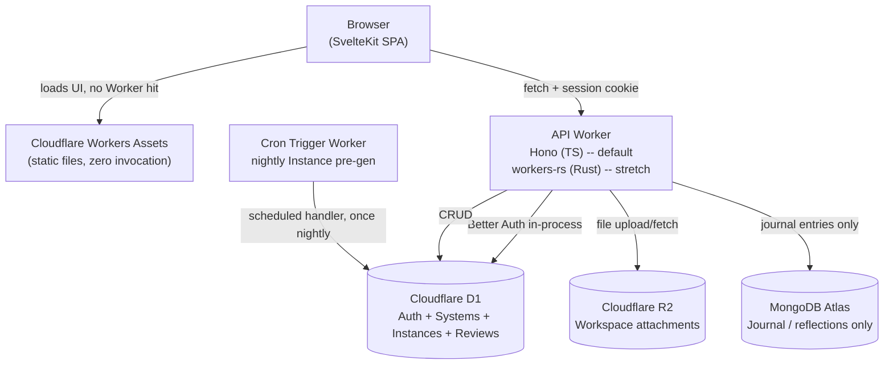

# Tech Stack & Architecture Decision Record (ARD)

**Project:** *Polaris*
**Document type:** Architecture Decision Record -- a companion to the product PRD, covering technology choices, rationale, and component roles (not feature scope or schema, which live in the PRD).
**Status:** Draft -- MVP architecture
**Last updated:** June 30, 2026

---

## 1. Purpose

This document records what the stack is, why each piece was chosen over the alternatives that were considered, and what role each piece plays in the running system. It exists so the reasoning behind the stack survives independently of any one conversation or sprint.

## 2. Guiding Constraints

Three constraints shaped every decision below, in this order of priority:

1. **Free.** This is a passion project -- the stack needs to run on free tiers indefinitely, not "free while small."
2. **Ship it.** A working MVP matters more than a maximally ambitious one. The riskiest, least-proven pieces of the stack are not allowed to block the rest from shipping.
3. **Learn something new.** Within constraint #2, every layer was deliberately chosen to push into unfamiliar territory rather than default to the existing React/Next.js + FastAPI background.

These three pulled in different directions more than once -- see §6 and §7 for where that tension showed up and how it was resolved.

## 3. Stack at a Glance

| Layer | Choice | Role |
|---|---|---|
| Hosting platform | **Cloudflare** (Workers, D1, R2, Cron Triggers) | Single free platform for compute, data, storage, and scheduling -- all four are active v1 dependencies, not stretch goals |
| Frontend | **SvelteKit**, SSR disabled (CSR / SPA) | UI, served as static assets |
| Frontend interaction | **svelte-dnd-action** | Drag-and-drop for the Workspace Builder's widget canvas |
| Backend API | **Hono** (TypeScript)  | CRUD API between frontend and databases |
| Primary database | **Cloudflare D1** (SQLite) | Core structured data: Systems, Instances, Review entries |
| File storage | **Cloudflare R2** | Workspace attachments (e.g. source files, form-check photos) |
| Scheduled compute | **Cloudflare Cron Triggers** | Nightly Instance pre-generation -- see §5.7 |
| Secondary database | **MongoDB Atlas** | One bounded, document-shaped feature only |
| Auth | **Better Auth** | Self-hosted email/password auth on D1 |

## 4. Architecture

Everything except MongoDB Atlas lives inside Cloudflare's network. Auth is also in-process -- Better Auth runs inside the same Worker as the API, sharing the same D1 database. The Cron Trigger handler can live in the same Worker script as the API (a `scheduled` export alongside `fetch`) -- it does not need to be a separate deployment.

## 5. Component Decisions

### 5.1 Hosting -- Cloudflare

**Why:** generous, genuinely free tiers across compute (Workers), database (D1), storage (R2), and scheduling (Cron Triggers) -- no other platform covers all four under one free account.
**Used for:** static asset hosting, API compute, the primary database, workspace file storage, and the nightly Instance pre-generation job. All four are in active v1 use -- see §5.7 and §5.8.

### 5.2 Frontend -- SvelteKit (CSR-only) and Tailwind CSS

**Why SvelteKit over Next.js:** Next.js/React is already known -- the goal here was new ground. SvelteKit's compiler-driven reactivity (no virtual DOM, far less boilerplate per route) is a genuine departure, and it has first-class, production-ready support on Cloudflare Workers.

**Why CSR instead of SSR:** Cloudflare's free Workers plan caps CPU time at 10ms per request -- but that only counts actual computation, not time spent waiting on I/O. Full-page SSR is one of the most common ways to burn that budget, which lines up with hitting "CPU limit exceeded" on past projects. Serving SvelteKit as pure static files means **zero Worker invocation for the frontend at all** -- it can't hit a CPU limit by definition.

**Used for:** all UI -- dashboards, forms, and lists for Systems, Instances, and Review entries.

**Drag-and-drop dependency -- `svelte-dnd-action`:** the Workspace Builder (PRD §6.2) needs a drag-and-drop canvas for arranging widgets. `svelte-dnd-action` is the standard choice for Svelte -- it's framework-native (no React-shim libraries like `react-dnd` ported over), has no runtime dependencies beyond Svelte itself, and works with Svelte 5's reactivity model. It only governs widget *position and ordering* on the canvas (stored as the `layout` JSON blob on Workspace, PRD §5.4) -- it has no opinion on what a widget renders, which stays app-specific.

### 5.3 Backend API -- Hono (default)

**Why Hono:** purpose-built for the Workers runtime, no adapter layer, minimal overhead -- a natural fit for a thin CRUD API.

**Used for:** authenticated CRUD endpoints and talking to D1 (and, for the one journal feature, MongoDB). Auth (Better Auth) runs in-process -- see §5.6.

### 5.4 Primary database -- Cloudflare D1

**Why:** the core data (Systems, Instances, Review entries) is fixed, structured, relational -- exactly what SQL is built for. D1 sits inside the same edge network as the Worker (no extra network hop, no separate account), and its free tier (5 GB storage, 5M rows read/day, 100K rows written/day) is far beyond what a personal app will reach.

**Used for:** all core app data.

### 5.5 Secondary database -- MongoDB Atlas

**Why it's here at all:** an explicit, separate goal -- learning MongoDB/NoSQL patterns -- not a technical requirement of the app.

**Why it's bounded to one feature:** Atlas's HTTP Data API was deprecated and removed in September 2025; the remaining path is the raw TCP driver, which pays a fresh TCP+TLS handshake on every cold Worker invocation, with no connection pooling available for Mongo. That cost is acceptable for one non-critical-path feature -- it would be a real problem if it sat on every page load.

**Used for:** one genuinely document-shaped feature -- free-form journal / reflection entries -- and nothing else. The core schema stays on D1.

### 5.6 Auth -- Better Auth (self-hosted on D1)

**Why Better Auth instead of an external provider:** The decision evolved over time. originally it was Clerk, but Clerk production mode requires a custom domain, and Polaris runs on `*.workers.dev`. Development mode's 5-user limit and session wipes weren't acceptable.

Better Auth is an open-source, self-hosted auth library with native D1 support (no adapter packages needed). Key properties:

- **No external service** -- auth lives in-process inside the same Worker as the API, sharing the same D1 database. One deployment, one backup strategy, no network hop for session verification.
- **No domain requirement** -- works on `*.workers.dev` subdomains with no custom domain gate.
- **No usage ceiling** -- D1's free tier (5 GB) far exceeds what a personal auth table needs, and there's no per-user licensing cost.
- **Native Svelte 5 integration** -- `better-auth/svelte` provides runes-compatible stores (`authClient.useSession()`) that work directly with `$state`, `$effect`, and Svelte 5's reactivity model.
- **Cookie-based sessions** -- Better Auth manages HTTP-only session cookies with CSRF protection. The frontend uses `credentials: 'include'` on all API requests. Vite proxy in dev handles same-origin forwarding.

**What was given up vs. Clerk:**

- Sign-up/sign-in UI is hand-built (Clerk provides a hosted UI) -- form fields, validation, error handling, loading states are all custom.
- Password reset flow requires explicit configuration and UI (Clerk handled it automatically).
- Cookie-based auth is less friendly to API clients than Bearer JWTs.

### 5.7 File storage -- Cloudflare R2

**Why it's a v1 dependency, not deferred:** workspace widgets (Link list, Log entries) are expected to hold attachments -- a source PDF on a Study workspace, a form-check photo on a Health workspace. That's a real v1 use case, not a future one, so R2 is scoped in from the start rather than added later as a stretch.

**Why R2 over an external object store:** same reasoning as D1 -- same network, same account, no extra service to provision or pay for. Free tier (10 GB-month storage, 1M Class A operations/month, 10M Class B operations/month) is far beyond personal-app volume, and R2 has zero egress fees, which matters if attachments get viewed often (e.g. repeatedly opening a reference PDF).

**Used for:** file attachments on workspace widgets. Files are uploaded via the API Worker (presigned-style flow or proxied upload) and referenced from D1 by key -- D1 stores the pointer (`r2_key`, `filename`, `content_type`, `size`), R2 stores the bytes. No file metadata lives in R2 itself.

**Bound:** attachments only. R2 is not used for application code, build artifacts, or database backups in v1 -- those stay out of scope until there's an actual need.

### 5.8 Scheduled compute -- Cron Triggers (nightly Instance pre-generation)

**What it does:** PRD §5.3 specifies that Instances (a day's occurrence of a System) auto-generate lazily when the dashboard loads. The PRD's open question (§13.1) asked whether to *also* run a nightly job so tomorrow's Instance is visible the night before, rather than only appearing once the user opens the app the next day.

**Decision: yes, add a nightly Cron Trigger.** It's a small, well-bounded addition and meaningfully improves the "Review Day at night, see tomorrow already queued" experience without adding real risk.

**Does it work on the free tier? Yes, comfortably,** for this specific workload:

- Cron Triggers are included on the Workers Free plan at no extra cost, with a limit of 5 triggers per account on Free (250 on Paid) -- one nightly job uses one slot, well inside that.
- As of 2026, Cron Triggers support a 1-minute minimum cadence -- once-a-day is far coarser than the floor, no constraint there.
- The job itself is cheap: query active Systems whose schedule matches "tomorrow," skip any that already have an Instance for that date (idempotency check), batch-insert the rest into D1. For a personal account with even a few dozen active Systems, this is a handful of D1 reads and writes -- nowhere close to the 10ms free-tier CPU budget per invocation (CPU time excludes time spent waiting on D1 I/O) or the 100K-requests/day cap (a scheduled invocation counts as one request).
- The handler can live as a `scheduled` export in the same Worker script as the API (Hono) -- no separate deployment, no separate billing surface.

**Known limitations to design around:**

- **UTC only, no per-user timezone.** Cron Triggers fire on UTC time; there's no native per-account timezone setting. For a single-user personal app this is manageable -- pick a fixed UTC cron expression that lands at a sensible local evening (e.g. `0 3 * * *` UTC for roughly 7-8pm Pacific, depending on DST), and accept that the "night before" cutoff is approximate rather than exact. Not worth solving more rigorously for a single-user app.
- **No automatic retry on failure.** If the scheduled handler throws or exceeds its CPU budget, Cloudflare does not retry -- the next attempt is the next scheduled tick (24 hours later). Mitigation: the lazy dashboard-load generation (PRD §5.3) remains the source of truth and safety net regardless -- if the nightly job silently fails one night, the user still gets a correct Instance the moment they open the dashboard. The nightly job is a convenience layer on top of the lazy path, never a replacement for it.
- **Idempotency is required, not optional.** Because there's no guaranteed single-fire semantics across retries/redeploys, the nightly job must be safe to run twice for the same date (check-before-insert on `(system_id, date)`, which is already a natural unique constraint on the Instance table).

**Used for:** one nightly scheduled job. No other Cron Trigger uses are planned for v1.

| Considered | Rejected because |
|---|---|
| Next.js | Already known -- no new learning |
| MongoDB as primary DB | Core schema is fixed/structured; SQL fits better; Atlas adds latency with no connection pooling |
| Qwik, Astro | Their core advantage (first-load speed / SEO) doesn't apply to a personal, logged-in app |
| Leptos / Yew as the *shipped* frontend | New language + new paradigm + thin ecosystem all at once is too much risk for the highest-visibility layer of an MVP |
| Clerk (auth) | Production mode requires a custom domain -- incompatible with `workers.dev` subdomain. See ADR-003. |
| Lucia (auth) | Deprecated by its own maintainer; now a from-scratch implementation guide, not a library |
| Rolling our own auth | High time cost for a non-differentiating feature |

## 8. Open Risks

| Risk | Mitigation |
|---|---|---|
| Mongo Atlas cold-start latency | Confined to one non-critical-path feature |
| Better Auth CSRF blocks Vite proxy in dev | Configured `trustedOrigins` for `localhost:5173` |
| Rust backend may not land in the time-box | Hono is an explicit, always-working fallback |
| Free-tier limits change over time (D1, Cloudflare) | Re-check the numbers in §3 before relying on them as usage grows |
| Better Auth receives fewer security audits than Clerk | Self-hosted means dependency is minimal and well-understood; updates are manual but visible |
