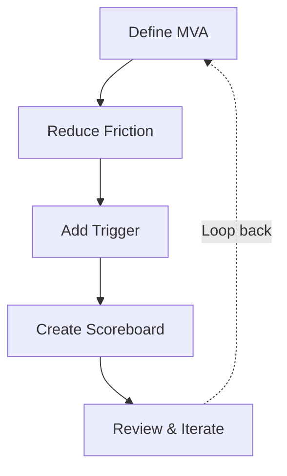

# The Master Systems Framework

*A complete guide to building systems that outlast motivation*

Goal-Setting · Time Management · Health · Finance · Learning

*Includes: Step-by-step guide to building any system from scratch*

---

## Part 01: What Is a System - and Why It Beats Goals

A system is a network of interconnected actions, processes, and habits that consistently produce a result - without relying on motivation or willpower.

Goals give you direction. Systems make success inevitable. The key insight: **design for your worst day, not your best.**

| Goals | Systems |
|-------|---------|
| Conditional - depend on high motivation | Reliable - work even on bad days |
| Outcome-focused | Process-focused |
| Fail when motivation fades | Built to survive motivation fading |
| Celebrate arrival | Celebrate consistency |
| External pressure needed | Internal automation builds over time |

### The Effort Curve

Building a system requires more effort upfront. But over time, it drastically reduces the energy needed to execute. Motivation costs energy every day. A system costs energy once.

---

## Part 02: The Core Philosophy - 5 Principles

### 1. Systems over willpower

Motivation is unreliable. A good system works even when you don't feel like it - because it removes the decision entirely. You don't decide whether to do it. The system decides for you.

### 2. Failures are system errors, not personal flaws

When you fall short, don't self-blame. Ask: what in the process broke down? A system error is fixable. A personal flaw feels permanent. Reframing failure as data removes the emotional charge.

### 3. Reduce friction obsessively

If a habit takes too much setup, you won't do it on hard days. Every extra step is a drop-off point. The best system is the one you'll actually run at 20% energy. Remove obstacles before you need to overcome them.

### 4. Build for repeatability

Temporary fixes (naps, timers, willpower sprints) are fine short-term - but always work toward solving the root cause. Retraining habits is an essential part of the system. Patch it, then fix it.

### 5. Embrace identity shift

Don't just chase outcomes. Act like the person who already has the results you want. True discipline comes from aligning daily actions with the identity of who you're becoming - not just the goal you're chasing.

---

## Part 03: The Five Life Systems

These five systems cover the major domains of a balanced, productive life. Each one removes a category of decisions and makes the right action automatic.

### Goal-Setting System

**GPS Method:** Goal -> Plan -> System

- Define a long-term vision (3-5 years out)
- Sketch a 3-year milestone - what does progress look like?
- Break it into quarterly quests - 90-day focused sprints
- Each quarter: pick 1-3 objectives, not 10

### Time Management System

**Time Blocking** - schedule the important things first

- Block health, relationships, and deep work before anything else
- Don't fit important things in - protect them in advance
- Treat blocked time like a meeting you cannot cancel
- Review and re-block every Sunday for the coming week

### Health OS

Systematize sleep, diet, and movement

- Fixed wake time - same daily, even weekends (this is your anchor)
- Meal prep once a week to eliminate daily food decisions
- Schedule gym sessions like appointments - not "when I feel like it"
- Set a daily step goal as a floor, not a target

### Relationship System

Intentional scheduling of connection

- Weekly standing social event (dinner, call, activity)
- Monthly one-on-one time with people who matter most
- Annual trip or shared experience to create shared memory
- Don't leave relationships to "whenever I have time" - it never comes

### Personal Finance System

Allocate before you spend - automate the rest

- On payday: immediately allocate to savings and investment buckets
- Spend only what remains after allocation - never "save what's left"
- Automate savings transfers so no decision is needed
- Weekly 5-minute review - not daily anxiety, not monthly panic

---

## Part 04: The Learning System - PERO Framework

PERO structures every learning session into four phases. Use this for any knowledge-based goal - studying, skill-building, or exam prep.

### Priming (2-5 min)

Prepare your brain before the main session. Find relevance. Reduce overload.

- Skim headings, titles, and bold text before reading
- Ask: What is this about? Where is it used? What do I already know?
- This prevents your brain from filtering the content as "irrelevant"

### Encoding (Main block)

Actively process and simplify. Never passively re-read.

- Explain concepts in your own words as you go
- Draw diagrams and mind maps - force the brain to reorganize ideas
- Break complex ideas into the simplest possible terms

### Reference (During session)

Park fine details so your brain can focus on concepts.

- Use Anki or a notes app to capture specifics
- Keep notes short - single sentences, not paragraphs
- This frees working memory for understanding, not memorization

### Retrieval (15-20 min)

Test yourself. This is the most important phase.

- Recall everything without looking at notes
- Solve practice problems, explain concepts aloud, or write from memory
- Interleave topics - mix subjects to strengthen connections

**Overlearning (Optional):** Go beyond basic understanding for enhanced fluency and faster recall. Only necessary for highly competitive assessments or very difficult material. Do not overlearn everything - it is expensive. Reserve it for what really matters.

---

## Part 05: The 5-Step System-Build Process

This is the core process. Follow these five steps in order to design a system that survives real life including your worst days.

*The examples throughout this section use a consistent scenario: a student who wants to build a daily reading habit.*

---

### Step 1: Define Your Minimum Viable Action (MVA)

#### What it means

The MVA is the smallest version of your system that counts as a win. It must be so small that doing it on your absolute worst day - sick, exhausted, overwhelmed - feels almost effortless. This is your floor, not your ceiling.

#### Why it matters

Most systems fail because they are designed for good days. When a hard day comes, the system feels too heavy, you skip it, guilt builds, and you quit. The MVA keeps the streak alive.

#### How to define it

Ask yourself: *"If I had zero energy and only 10 minutes, what is the one thing I could still do that keeps this system alive?"*

**Example - Reading Habit**

- Bad MVA: "Read 30 pages per day" - too heavy on hard days
- Better MVA: "Read 1 page before bed" - almost impossible to skip
- Even better: "Open the book and read one paragraph"

*Note: On good days you will read far more. The MVA is just the minimum. The streak stays alive. The habit survives. That is all that matters.*

---

### Step 2: Reduce Friction

#### What it means

Every step between you and the habit is a potential drop-off point. Friction accumulates invisibly - a charger in the wrong room, an app on the second screen, a book buried under other things. Remove all of it.

#### The Friction Audit

List every physical and mental step between you and your habit. Then systematically eliminate or automate each one. If a setup step takes more than 30 seconds, it will kill the habit on bad days.

#### Environment design

Make the good behavior the path of least resistance. Make the bad behavior harder. Your environment should pull you toward the habit without any decision required.

**Example - Reading Habit**

- Friction before: book is on the shelf, phone is on the nightstand
- Friction audit: you reach for the phone before the book every night
- -> Fix 1: Put the book on top of the phone charger (physically blocks it)
- -> Fix 2: Move phone charger to another room entirely
- -> Fix 3: Leave book open on the current page - no searching needed
- Result: Picking up the book is now the easiest thing to reach for.

---

### Step 3: Add System Triggers (Habit Stacking)

#### What it means

A trigger is an existing behavior that automatically cues the new habit. Instead of relying on willpower to remember, you attach the new habit to something you already do without thinking.

#### The formula

> "After I [EXISTING HABIT], I will [NEW HABIT]."

The existing habit becomes the automatic reminder. No alarms, no sticky notes, no willpower required.

#### Choosing the right trigger

Pick a trigger that occurs at the same time and place as when you want the habit. It should have a clear, reliable end-point (finishing a meal, turning off the shower, getting into bed).

**Example - Reading Habit**

- ❌ Bad trigger: "I will read when I feel like it" - no automatic cue
- ❌ Bad trigger: "I will read at 9pm" - time-based, easy to forget or reschedule
- ✅ Good trigger: "After I brush my teeth, I will read 1 page"

Brushing teeth is daily, has a clear end, and already happens at bedtime.

- Stack: Wake up -> coffee -> read. Alarm -> brush teeth -> read.

The existing habit does the remembering. You just follow the chain.

---

### Step 4: Create a Scoreboard

#### What it means

Track your daily actions visibly. A scoreboard converts invisible progress into something you can see and feel. It provides positive reinforcement and makes skipping feel costly.

#### What to track

Track the action (did you do it?) not the outcome (did you read a lot?). Outcomes are noisy and unreliable short-term. Actions are in your control every single day.

#### The "don't break the chain" effect

Once you have a streak, the streak itself becomes motivating. You do the habit not just for the habit - but to protect the chain. This is a system that reinforces itself.

**Example - Reading Habit**

- Option 1: Paper calendar - cross off each day you read. Visual, physical, satisfying.
- Option 2: Habit tracking app (Streaks, Habitica, Notion template)
- Option 3: Simple notes file - date + checkbox + pages read

Track: Did I open the book today? (Yes/No) - not "how many pages"

Weekly review: How many days did I hit the MVA? Target 5/7 minimum. Aim for consistency, not perfection. 80% sustained beats 100% burned out.

---

### Step 5: Review and Iterate Weekly

#### What it means

Successful systems include a built-in review mechanism. Every week, you analyze what worked, what broke, and what you can simplify. The system should get easier over time - not harder.

#### The weekly review questions

Run these five questions every Sunday (takes 5-10 minutes):

1. What worked this week? (Protect these elements)
2. What broke down, and why? (Friction? Timing? Missing trigger?)
3. What was my bad day like? (Did the MVA hold?)
4. What can I simplify or remove?
5. What is one small upgrade to make next week easier?

#### Iteration principle

Never blame yourself for a system failure. A system error is just data. Identify the exact failure point, fix it, and run again. This is how the system compounds over time.

**Example - Reading Habit**

Week 1 review: "I read 5/7 days. I skipped Tuesday and Thursday."

- Diagnosis: "Tuesday I fell asleep before brushing teeth - missed the trigger."
- Fix: Add a phone reminder at 9:45pm as a backup trigger
- Diagnosis: "Thursday I was too tired even for 1 page."
- Fix: Lower MVA to "touch the book and read the chapter title only"

Week 2: New trigger + smaller MVA. System is now more robust.

---

## Part 06: Putting It All Together - The Full Build Process

Here is the complete process condensed into a single reference. Use this as a checklist every time you design a new system.

| Step | Focus | Key Question |
|------|-------|--------------|
| **1 - MVA** | Define the smallest possible win | What can I do at 10% energy that keeps this alive? |
| **2 - Friction** | Remove every obstacle | What makes this hard to start? Eliminate each one. |
| **3 - Trigger** | Stack onto existing habit | After I do [X], I will do [new habit]. |
| **4 - Scoreboard** | Track the action daily | Did I do it today? (Yes/No - not "how much") |
| **5 - Review** | Iterate every week | What broke? What can I simplify? What is one upgrade? |

---

## Key Reminders

- **Design for your WORST day** - not your best. The system must survive hard weeks.
- **A failure is a system error** - not a personal flaw. Fix the process, not yourself.
- **Aim for 80% consistency** - Sustainable beats perfect. Always.
- **Every week, make the system slightly easier** - It should compound, not compound stress.

---

> "Systems make success inevitable. Design for your worst day. Show up. Fix what breaks. That is the whole system."

---

## System Build Process - Quick Reference

---

*End of Framework*
