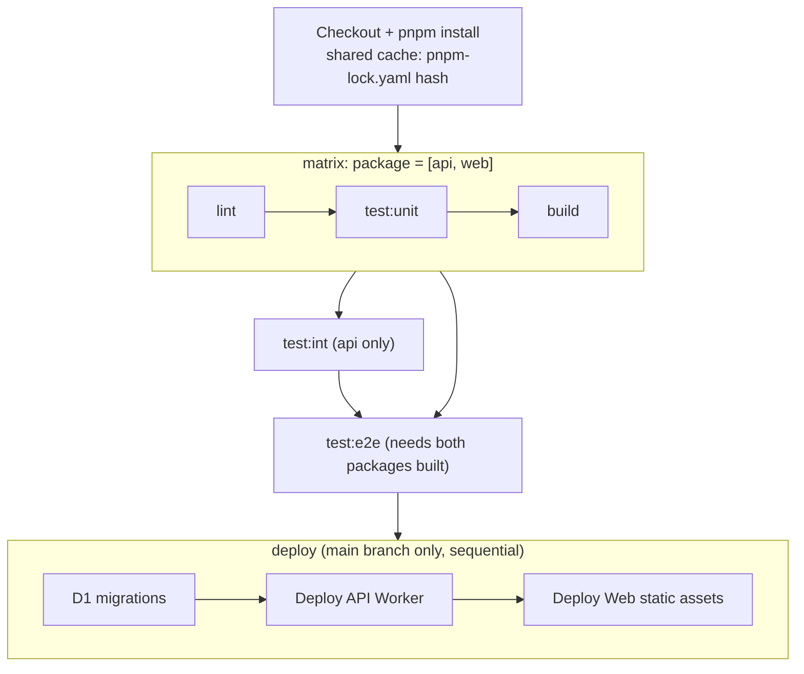

# CI/CD & Deployment

**Project:** *Polaris*

**Document type:** Deployment reference -- defines the CI pipeline, deploy order, environment configuration, and rollback strategy. Companion to the [Tech Stack ADR](../ADRs/001-tech-stack-adr.md) (owns the monorepo structure and deployment targets this document operationalizes), the [Testing Strategy](testing-strategy.md) (owns the CI pipeline's test stages), and the [API Route Design](api-routes.md) / [SvelteKit Route Architecture](sveltekit-route-architecture.md) (which define the two deployable artifacts).

**Status:** Draft -- v1 scope

**Implementation status:** Planned / Target Architecture

**Last updated:** July 2, 2026

---

## 1. Artifacts

Two independent deployments:

| Artifact | Directory | Type | Wrangler command |
|---|---|---|---|
| API Worker | `packages/api/` | Workers script + scheduled handler + queue consumer | `wrangler deploy` |
| Web static assets | `packages/web/` | Workers Static Assets (SPA build output) | `wrangler deploy` |

They are deployed independently but always in a specific order (see 3.1). They have no circular dependency -- the Web assets are pure static files that make API calls to whatever origin `VITE_API_BASE_URL` is configured for. A new version of the API Worker can be deployed without touching the frontend, and vice versa, as long as the API contract is backward-compatible (which it always is in v1, since both artifacts are deployed in lockstep from the same commit).

Both artifacts are built and tested in parallel via CI's package matrix (S4) before either is deployed -- see S4.1 for the full pipeline graph.

---

## 2. Environment Configuration

### 2.1 Variables

| Variable | Package | Dev | Production | Secret? |
|---|---|---|---|---|
| `VITE_API_BASE_URL` | `web` | `''` (empty -- same-origin via Vite proxy) | `https://polaris-api.kelpselp.workers.dev` | No |
| `ENVIRONMENT` | `api` | `development` | `production` | No |
| `BETTER_AUTH_SECRET` | `api` | Auto-generated dev secret | Generated secret, stored in `wrangler secret` | Yes |
| `BETTER_AUTH_URL` | `api` | `http://localhost:8787` | `https://polaris-api.kelpselp.workers.dev` | No |
| `MONGODB_URI` | `api` | `mongodb://localhost:27017/polaris` (local Mongo) | Atlas connection string, stored in `wrangler secret` | Yes |

### 2.2 `wrangler.jsonc` -- `packages/api/`

```toml
name = "polaris-api"
main = "src/index.ts"
compatibility_date = "2026-07-01"

# Bindings
[[d1_databases]]
binding = "DB"
database_name = "polaris-db"
database_id = "<uuid>"

[[r2_buckets]]
binding = "ATTACHMENTS"
bucket_name = "polaris-attachments"

[[queues]]
binding = "JOURNAL_RETRY"
queue_name = "polaris-journal-retry"

[ai]
binding = "AI"

[triggers]
crons = ["0 15 * * *"]   # 11 PM Asia/Manila, UTC+8

# Environment-specific values
[env.development]
vars = { ENVIRONMENT = "development" }
[[env.development.d1_databases]]
binding = "DB"
database_name = "polaris-db-dev"
database_id = "<dev-uuid>"

[env.production]
vars = { ENVIRONMENT = "production" }
[[env.production.d1_databases]]
binding = "DB"
database_name = "polaris-db"
database_id = "<prod-uuid>"
```

**Note:** `BETTER_AUTH_SECRET` and `MONGODB_URI` are NOT in `wrangler.jsonc` -- they are set via `wrangler secret put` and accessed via `env.BETTER_AUTH_SECRET` / `env.MONGODB_URI` at runtime. This keeps them out of version control.

### 2.3 `wrangler.jsonc` -- `packages/web/`

```jsonc
{
  "name": "polaris-web",
  "main": "build/index.html",
  "compatibility_date": "2026-6-30",
  "site": {
    "bucket": "build"
  }
}
```

**Note:** The `"site"` key above is the Workers Sites pattern (deprecated). The modern Workers Static Assets pattern uses `"assets": { "directory": "build", "binding": "ASSETS" }` instead. Both patterns are supported by `wrangler deploy` as of June 2026; the `"site"` pattern remains here because the SvelteKit Cloudflare adapter still emits it by default. When the adapter or wrangler deprecates `"site"`, migrate to the `"assets"` pattern.

Workers Static Assets (the modern pattern replacing `workers-site/` and `@cloudflare/kv-asset-handler`) serves the `build/` directory directly without a custom Worker script. `main` is set to `build/index.html` as the SPA fallback entry point. No bindings are needed -- this deployment serves files only.

---

## 3. Deploy Order and Scripts

### 3.1 Order

```
1. D1 migrations (packages/api)  -- wrangler d1 migrations apply DB
2. API Worker (packages/api)     -- wrangler deploy
3. Web static (packages/web)     -- wrangler deploy
```

Migrations run **before** the API Worker deploy so the new code sees the latest schema on its first request. The Web deploy runs last because it has no dependency on the API deployment order beyond `VITE_API_BASE_URL` being correct (which is baked at build time, not deploy time).

**Two ways this order is enforced, depending on path:**

- **Via CI (the normal path, on merge to `main`):** the `deploy` job in S4 runs all three steps in this exact sequence, automatically, only after every test/build stage across both packages has passed. This is the default -- see S4.2 for the workflow definition.
- **Via manual deploy (local machine, day-to-day or first-time setup):** the scripts below run the same three steps by hand. Still useful for local verification before pushing, or for the very first deploy before CI/secrets exist (S3.2).

**Script in root `package.json`:**

```jsonc
{
  "scripts": {
    "deploy": "pnpm -r deploy",
    "deploy:migrations": "cd packages/api && wrangler d1 migrations apply DB",
    "deploy:api": "cd packages/api && wrangler deploy",
    "deploy:web": "cd packages/web && wrangler deploy",
  }
}
```

Each package has its own `deploy` script in its `package.json`:

```jsonc
// packages/api/package.json
{ "scripts": { "deploy": "wrangler d1 migrations apply DB && wrangler deploy" } }

// packages/web/package.json
{ "scripts": { "deploy": "vite build && wrangler deploy" } }
```

Running `pnpm -r deploy` from the root runs both in workspace order (api first, web second) because pnpm respects the dependency graph: `web` depends on `api` (for types), so pnpm runs `api`'s deploy first.

### 3.2 Day-to-day manual deploy (fallback, pre-CI or local verification)

```bash
git pull
pnpm install                     # if dependencies changed
pnpm -r build                    # verify both packages build
pnpm -r deploy                   # migrations, api, web
```

---

## 4. CI Pipeline

Runs on every push to `main` and every PR. Defined in `.github/workflows/ci.yml`.

### 4.0 Why a matrix, and what it does/doesn't parallelize

**Note on script availability:** The CI pipeline references `lint`, `test:unit`, `test:int`, and `test:e2e` scripts. As of the current scaffold, only `build` and `deploy` exist in `root package.json`. The test/lint scripts are target-state -- they must be added to each package's `package.json` as part of the P0 Implementation Plan before CI can run.

`lint`, `test:unit`, and `build` are independent per package -- `web`'s lint failing has no bearing on `api`'s unit tests passing, and today's `pnpm -r` runs them serially anyway. Matrixing over `package: [api, web]` runs these three stages concurrently instead, which is the actual bottleneck.

**What stays outside the matrix:**

- `test:int` -- `api`-only (Miniflare/D1); `web` has no integration layer (Testing Strategy S3.2). Matrixing a stage that only exists for one leg buys nothing.
- `test:e2e` -- needs *both* packages built and running together (Testing Strategy S3.3); it depends on the whole matrix finishing, not a single leg.
- `deploy` -- stays a single sequential job (migrations -> API -> web). This ordering is load-bearing (S3.1) and is never matrixed, regardless of how the test stages are parallelized.

### 4.1 Pipeline graph



Every matrix leg, `test:int`, and `test:e2e` must succeed before `deploy` runs at all -- `fail-fast: true` on the matrix means one failing leg cancels its siblings immediately, and `deploy`'s `needs:` list means a single red job anywhere upstream skips deploy entirely, never a partial deploy.

### 4.2 Workflow definition

```yaml
name: CI
on: [push, pull_request]

jobs:
  test:
    strategy:
      fail-fast: true
      matrix:
        package: [api, web]
    runs-on: ubuntu-latest
    steps:
      - uses: actions/checkout@v4
      - uses: pnpm/action-setup@v4
      - uses: actions/setup-node@v4
        with:
          node-version: 22
          cache: pnpm       # keyed on the single root pnpm-lock.yaml -- shared across both matrix legs

      - run: pnpm install --frozen-lockfile

      - name: Lint (${{ matrix.package }})
        run: pnpm --filter ${{ matrix.package }} lint

      - name: Unit tests (${{ matrix.package }})
        run: pnpm --filter ${{ matrix.package }} test:unit

      - name: Build (${{ matrix.package }})
        run: pnpm --filter ${{ matrix.package }} build

  integration:
    needs: test
    runs-on: ubuntu-latest
    steps:
      - uses: actions/checkout@v4
      - uses: pnpm/action-setup@v4
      - uses: actions/setup-node@v4
        with:
          node-version: 22
          cache: pnpm
      - run: pnpm install --frozen-lockfile
      - run: pnpm --filter api test:int   # @cloudflare/vitest-pool-workers -- api only, see Testing Strategy S3.2

  e2e:
    needs: [test, integration]
    runs-on: ubuntu-latest
    steps:
      - uses: actions/checkout@v4
      - uses: pnpm/action-setup@v4
      - uses: actions/setup-node@v4
        with:
          node-version: 22
          cache: pnpm
      - run: pnpm install --frozen-lockfile
      - run: pnpm -r build
      - run: pnpm test:e2e
        env:
          VITE_API_BASE_URL: "http://localhost:8787"

  deploy:
    if: github.ref == 'refs/heads/main'
    needs: [test, integration, e2e]     # any failure anywhere above skips this job entirely
    runs-on: ubuntu-latest
    steps:
      - uses: actions/checkout@v4
      - uses: pnpm/action-setup@v4
      - uses: actions/setup-node@v4
        with:
          node-version: 22
          cache: pnpm
      - run: pnpm install --frozen-lockfile

      - name: Apply D1 migrations
        working-directory: packages/api
        run: npx wrangler d1 migrations apply DB --remote
        env:
          CLOUDFLARE_API_TOKEN: ${{ secrets.CLOUDFLARE_API_TOKEN }}

      - name: Deploy API Worker
        working-directory: packages/api
        run: npx wrangler deploy
        env:
          CLOUDFLARE_API_TOKEN: ${{ secrets.CLOUDFLARE_API_TOKEN }}

      - name: Deploy Web static assets
        working-directory: packages/web
        run: npx wrangler deploy
        env:
          CLOUDFLARE_API_TOKEN: ${{ secrets.CLOUDFLARE_API_TOKEN }}
```

**Note on migrations in CI:** The `deploy` job applies D1 migrations as its first step, before deploying either Worker. This is a change from the original doc (which kept migrations manual-only). The reason: gating. With migrations inside CI, a bad migration blocks `wrangler deploy` from running at all -- same job, same failure surface -- rather than being a separate manual step a developer could forget to run before pushing. The append-only migration convention (ADR 002 S6.2) already protects against destructive schema changes, so the only failure mode CI catches immediately that a manual process would miss is "migration fails to apply," which is exactly what you want to catch.

### 4.3 What the CI pipeline does NOT do

| Activity | Reason |
|---|---|
| **Matrix the deploy job** | Deploy order (migrations -> API -> web) is load-bearing; matrixing would remove that guarantee. See S4.0. |
| **Per-package cache keys** | Single pnpm workspace, single lockfile -- one shared cache key covers both matrix legs; per-package keys would duplicate the same cache for no benefit. |
| **Deploy to staging/preview** | No staging environment exists. Deploy is directly to production on `main` only, gated by the full matrix + integration + e2e passing. |
| **`wrangler secret` management in CI** | Secrets (`BETTER_AUTH_SECRET`, `MONGODB_URI`) are set manually via `wrangler secret put` and are not available in CI. If CI needed to deploy to an ephemeral environment, this would need solving; for a single-deployment personal app with no staging environment, manual secret management is correct. |

---

## 5. URL Structure

| Environment | API URL | Web URL |
|---|---|---|
| Development (local) | `http://localhost:8787` | `http://localhost:5173` |
| Production | `https://polaris-api.kelpselp.workers.dev` | `https://polaris.kelpselp.workers.dev` |

These URLs are determined by the `name` field in each `wrangler.jsonc` (`polaris-api` and `polaris-web` substituted with the actual account subdomain `kelpselp`).

---

## 6. Rollback Strategy

For a single-developer personal app, rollback is manual and low-risk:

1. **API Worker:** `wrangler rollback` reverts to the previous deployed version. Wrangler keeps a version history; the rollback is instantaneous and does not require a rebuild.
2. **Web static assets:** `wrangler rollback` works the same way. If the static assets introduced a breaking client-side change and the API has already been rolled back, rolling back the web deployment restores the previous frontend version.
3. **D1 schema:** Migrations are never rolled back automatically. If a migration introduces a breaking schema change that needs reversal, a new forward migration is written (not a revert of the previous one). This is consistent with SQLite/D1's migration conventions -- `ALTER TABLE` is limited, and a "revert" migration is often a separate `CREATE TABLE ... AS SELECT` pattern rather than a simple `DOWN` script. This is a personal app; a broken migration is fixed by writing a corrective one, not by reverting history.
4. **Secrets:** `wrangler secret` changes are not versioned. If a secret rotation breaks the deployed Worker, re-set the previous value with `wrangler secret put`.

---

## 7. Local Development

### 7.1 Running both packages

```bash
# Terminal 1: API Worker
cd packages/api
pnpm dev                      # wrangler dev -- runs on :8787 and applies migrations

# Terminal 2: SvelteKit
cd packages/web
pnpm dev                      # vite dev -- runs on :5173 with proxy to :8787
```

### 7.2 D1 local development

`wrangler dev` (with `--local` flag or the default Miniflare-based local runtime) spins up a local SQLite database for D1. This is the same in-memory/on-disk SQLite used by integration tests (`@cloudflare/vitest-pool-workers`). The local database is at `.wrangler/state/v3/d1/<database_id>/db.sqlite` by default.

To apply migrations to the local database:

```bash
cd packages/api
wrangler d1 migrations apply DB --local
```

To wipe and recreate the local database (e.g. after a schema change):

```bash
rm -rf .wrangler/state/v3/d1
wrangler d1 migrations apply DB --local
```

### 7.3 R2 local development

`wrangler dev` emulates R2 in-memory. Objects written during development are lost when the process restarts. For attachments, this is acceptable -- upload a test file once per session.

### 7.4 AI local development

Workers AI calls (`env.AI.run()`) are **not emulated by Miniflare**. In local development, the AI route either calls the real Workers AI endpoint (if the environment has an active Workers AI account with remaining quota) or returns an error. To work on the System Creator's AI flow without burning neuron quota against a real model, the frontend can bypass the AI route entirely and type manual field values into the form.

---

## 8. Secrets Reference

| Secret | Where to generate | Set via |
|---|---|---|
| `BETTER_AUTH_SECRET` | Random 32-char hex string (`openssl rand -hex 32`) | `wrangler secret put BETTER_AUTH_SECRET` |
| `MONGODB_URI` | Atlas cluster connection string | `wrangler secret put MONGODB_URI` |

These are stored in Cloudflare's secrets store, not in `.env` files or `wrangler.jsonc`. They are accessed at runtime as `env.BETTER_AUTH_SECRET` and `env.MONGODB_URI` inside the Hono Worker.

---

## 9. Deploy Checklist

### 9.1 First-time setup (manual, once)

- [ ] Cloudflare account created
- [ ] D1 databases created (`wrangler d1 create polaris-db-dev`, `polaris-db`)
- [ ] R2 bucket created (`wrangler r2 bucket create polaris-attachments`)
- [ ] Queue created (`wrangler queues create polaris-journal-retry`)
- [ ] Secrets set locally (`wrangler secret put BETTER_AUTH_SECRET`, `MONGODB_URI`)
- [ ] Database UUIDs from step 2 written into both `wrangler.jsonc` files
- [ ] Migration files scaffolded via `wrangler d1 migrations create DB <name>` (one per table, per ADR 002 S6.2's numbered plan: `0001_enable_foreign_keys` through `0013_recovery_codes`) -- this only creates the empty, correctly-named file; the SQL inside each is hand-written, never auto-generated, and each file is frozen once created (append-only, no edits after the fact)
- [ ] Migrations applied manually (`wrangler d1 migrations apply DB --remote`) -- CI isn't wired up yet at this point
- [ ] Better Auth tables generated via the Better Auth CLI (`npx @better-auth/cli generate --config path/to/auth.ts --output packages/api/migrations/`) -- this is the only correct path for the Better Auth-managed tables (`user`, `session`, `account`, `verification`) per ADR 002 S2 and ADR 006 S1.1; do not hand-write these alongside the app's own migration files
- [ ] Better Auth tables applied to D1 via the CLI's `migrate` command (or by applying the CLI-generated SQL through `wrangler d1 migrations apply`, consistent with the app's own migration application step above)
- [ ] `CLOUDFLARE_API_TOKEN` added to GitHub Actions repo secrets -- required for the `deploy` job (S4.2) to authenticate; note this is separate from the `wrangler secret put` values above, which live in Cloudflare's secrets store, not GitHub's
- [ ] `pnpm -r build` succeeds locally
- [ ] `pnpm -r deploy` succeeds locally (manual first deploy, before trusting CI with it)
- [ ] Verify: sign up at `https://polaris.kelpselp.workers.dev`, create a system, see it on the dashboard
- [ ] Push to `main` once and confirm the CI `deploy` job runs migrations + both deploys successfully end-to-end

### 9.2 Ongoing deploys (after first-time setup, CI-driven)

- [ ] Push/merge to `main`
- [ ] Confirm `test` (matrix), `integration`, and `e2e` jobs all pass in the Actions tab
- [ ] Confirm `deploy` job ran migrations, then API, then web, in that order (S4.1's graph)
- [ ] Spot-check the deployed URL if the change touched a P0 flow (Testing Strategy S3.3)

Manual deploy (`pnpm -r deploy` from a local machine) remains available as a fallback -- e.g. if GitHub Actions itself is down, or for testing a migration against `--local` before pushing -- but is no longer the primary path once CI is wired up.
