# System Design: Paragon

**Document type:** System Design Document: a holistic architecture reference covering the full stack, data flow, deployment topology, and key design decisions. Companion to the ADRs (tech stack, schema), PRD (feature scope), and reference docs (auth, routes, testing). This document is the top-level entry point for understanding how the system works.

**Status:** Current

**Last updated:** July 20, 2026

---

## 1. Executive Summary

Paragon is a single-page web application for designing, running, and iterating on personal **systems**: repeatable processes with a floor action, a schedule, a dedicated workspace, and a recurring review loop. The core insight: design for the worst day, not the best one.

### Stack at a Glance

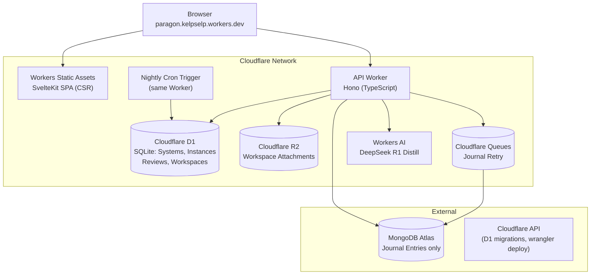
```mermaid
flowchart TB
    subgraph Cloudflare["Cloudflare Network"]
        direction TB
        Assets["Workers Static Assets<br/>SvelteKit SPA (CSR)"]
        API["API Worker<br/>Hono (TypeScript)"]
        Cron["Nightly Cron Trigger<br/>(same Worker)"]
        D1[("Cloudflare D1<br/>SQLite: Systems, Instances<br/>Reviews, Workspaces")]
        R2[("Cloudflare R2<br/>Workspace Attachments")]
        Q[("Cloudflare Queues<br/>Journal Retry")]
        AI["Workers AI<br/>DeepSeek R1 Distill"]
    end

    subgraph External["External"]
        Mongo[("MongoDB Atlas<br/>Journal Entries only")]
        CRA["Cloudflare API<br/>(D1 migrations, wrangler deploy)"]
    end

    Browser["Browser<br/>paragon.kelpselp.workers.dev"] --> Assets
    Browser --> API
    API --> D1
    API --> R2
    API --> Q
    API --> AI
    Q --> Mongo
    API --> Mongo
    Cron --> D1
```

| Layer | Choice | Role |
|---|---|---|
| Hosting | **Cloudflare** (Workers, D1, R2, Cron, Queues, AI) | Single platform for compute, storage, scheduling, and inference |
| Frontend | **SvelteKit** (SSR disabled, CSR/SPA) | UI served as static assets: zero Worker invocation for frontend |
| Backend API | **Hono** (TypeScript) | Thin CRUD API between frontend and databases |
| Primary DB | **Cloudflare D1** (SQLite) | All structured data: Systems, Instances, Reviews, Workspaces |
| Secondary DB | **MongoDB Atlas** | One bounded feature: freeform journal entries |
| File storage | **Cloudflare R2** | Workspace attachments (PDFs, images), proxied through Worker |
| Auth | **Better Auth** (self-hosted on D1) | Email/password, cookie-based sessions, recovery codes |
| Scheduled jobs | **Cron Triggers** | Nightly instance pre-generation |
| Message queue | **Cloudflare Queues** | MongoDB write retry with exponential backoff |
| AI inference | **Workers AI** (DeepSeek R1 Distill 32B) | AI-assisted system creation, suggest-only |
| Styling | **Tailwind CSS** | Utility-first, no runtime |
| Package manager | **pnpm** | Monorepo workspace management |

### Guiding Constraints

Four constraints shaped every architectural decision, in priority order:

1. **10ms CPU per request**: Cloudflare Workers free tier caps CPU time at 10ms per invocation (I/O wait excluded). Every server-side computation must fit within this budget. This is the single most restrictive constraint and overrides all other concerns.
2. **Free tier**: This is a passion project. The entire stack runs on free tiers indefinitely.
3. **Ship it**: A working MVP matters more than a maximally ambitious one.
4. **Learn something new**: Every layer pushes beyond the existing React/Next.js + FastAPI background.

> For deeper reading: [Tech Stack ADR](ADRs/001-tech-stack-adr.md), [PRD](PRD/PRD-systems-app.md), [Systems Framework](core/systems-framework.md)

---

## 2. Architecture Overview

### System Context

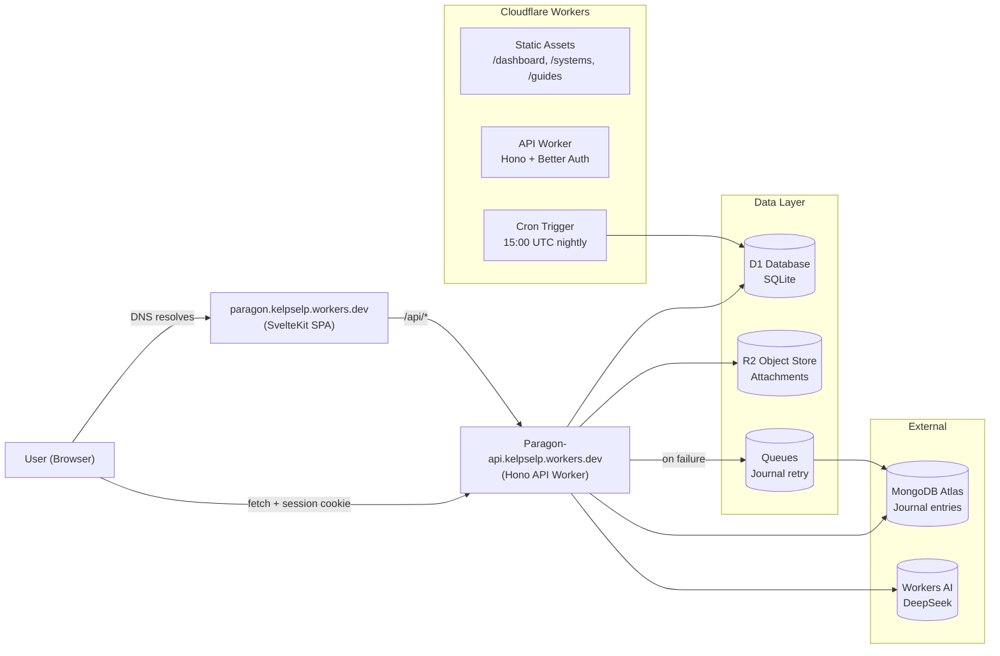
```mermaid
flowchart LR
    User["User (Browser)"]
    Domains["paragon.kelpselp.workers.dev<br/>(SvelteKit SPA)"]
    ApiDomain["Paragon-api.kelpselp.workers.dev<br/>(Hono API Worker)"]

    subgraph CF["Cloudflare Workers"]
        SPA["Static Assets<br/>/dashboard, /systems, /guides"]
        API["API Worker<br/>Hono + Better Auth"]
        CRON["Cron Trigger<br/>15:00 UTC nightly"]
    end

    subgraph Storage["Data Layer"]
        D1[("D1 Database<br/>SQLite")]
        R2[("R2 Object Store<br/>Attachments")]
        MQ[("Queues<br/>Journal retry")]
    end

    subgraph Ext["External"]
        MONGO[("MongoDB Atlas<br/>Journal entries")]
        WAI[("Workers AI<br/>DeepSeek")]
    end

    User -->|"DNS resolves"| Domains
    User -->|"fetch + session cookie"| ApiDomain
    Domains -->|"/api/*"| ApiDomain
    
    ApiDomain --> D1
    ApiDomain --> R2
    ApiDomain --> MONGO
    ApiDomain --> WAI
    ApiDomain -->|"on failure"| MQ
    MQ --> MONGO
    CRON --> D1
```

### Monorepo Structure

```
Paragon/
├── package.json                    # Root workspace scripts
├── pnpm-workspace.yaml
├── docs/                           # All documentation
│   ├── ADRs/                       # Architecture Decision Records
│   ├── PRD/                        # Product Requirements Document
│   ├── reference/                  # Operational specs
│   ├── core/                       # Domain philosophy docs
│   └── system-design.md            # < You are here
└── packages/
    ├── api/                        # Hono Worker: deployed independently
    │   ├── src/
    │   │   ├── index.ts            # fetch + scheduled + queue exports
    │   │   ├── auth.ts             # Better Auth instance
    │   │   ├── routes/             # Route handlers
    │   │   ├── services/           # Business logic
    │   │   ├── middleware/         # Auth guard, error handling
    │   │   └── lib/                # Utilities (recovery, ownership)
    │   ├── migrations/             # D1 SQL migrations
    │   └── wrangler.jsonc           # D1, R2, AI, Queue, Cron bindings
    └── web/                        # SvelteKit SPA: deployed independently
        ├── src/
        │   ├── routes/             # File-based routing (CSR only)
        │   ├── lib/
        │   │   ├── api/            # Typed API client modules
        │   │   ├── stores/         # $state-based stores
        │   │   └── components/     # UI components
        └── wrangler.jsonc           # Static assets only
```

### Two-Worker Deployment

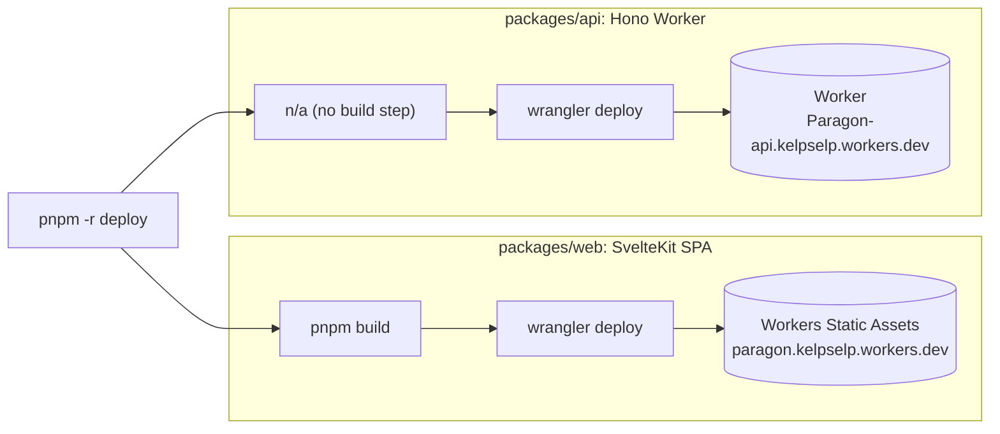
```mermaid
flowchart LR
    subgraph Web["packages/web: SvelteKit SPA"]
        WBuild["pnpm build"]
        WDeploy["wrangler deploy"]
        WS[("Workers Static Assets<br/>paragon.kelpselp.workers.dev")]
    end

    subgraph API["packages/api: Hono Worker"]
        ABuild["n/a (no build step)"]
        ADeploy["wrangler deploy"]
        AS[("Worker<br/>Paragon-api.kelpselp.workers.dev")]
    end

    Root["pnpm -r deploy"] --> WBuild --> WDeploy --> WS
    Root --> ABuild --> ADeploy --> AS
```

The frontend and API are **separate Workers on separate subdomains** within the same `workers.dev` account. This means:
- The frontend Worker serves static assets only: zero CPU budget used per page load.
- The API Worker handles all fetch, scheduled, and queue handlers: bound by the 10ms CPU limit.
- The session cookie crosses subdomains via `sameSite: lax` (not `strict`), with `credentials: 'include'` on every API request.
- They deploy independently: a frontend-only CSS change never touches the API Worker.

---

## 3. Data Flow Diagrams

### 3.1 Request Lifecycle

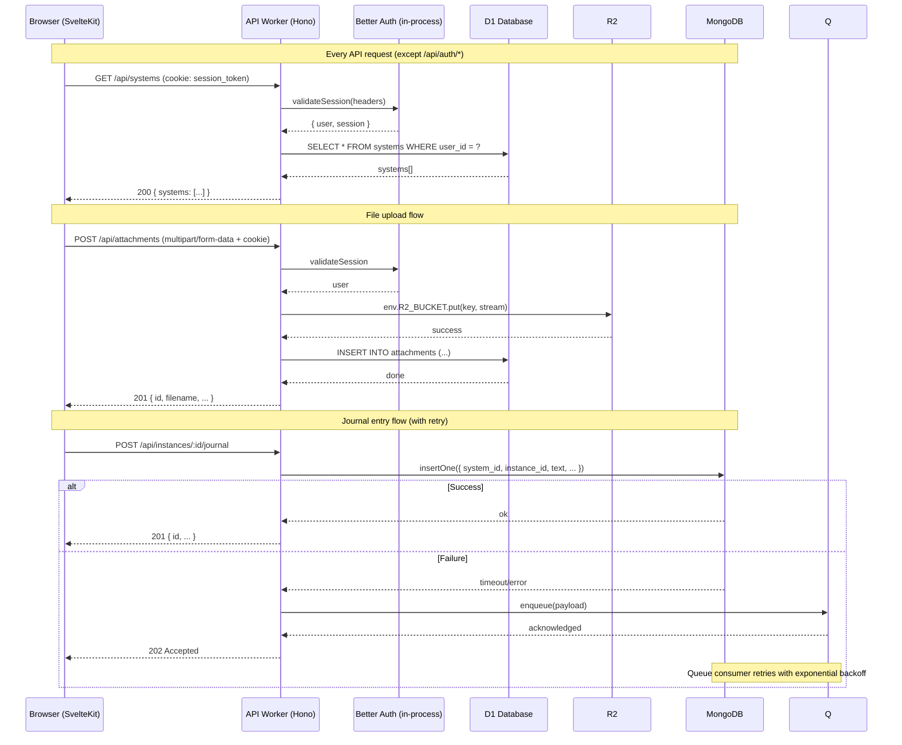
```mermaid
sequenceDiagram
    participant B as Browser (SvelteKit)
    participant A as API Worker (Hono)
    participant Auth as Better Auth (in-process)
    participant D as D1 Database
    participant R as R2
    participant M as MongoDB

    Note over B, M: Every API request (except /api/auth/*)

    B->>A: GET /api/systems (cookie: session_token)
    A->>Auth: validateSession(headers)
    Auth-->>A: { user, session }
    A->>D: SELECT * FROM systems WHERE user_id = ?
    D-->>A: systems[]
    A-->>B: 200 { systems: [...] }

    Note over B, M: File upload flow
    B->>A: POST /api/attachments (multipart/form-data + cookie)
    A->>Auth: validateSession
    Auth-->>A: user
    A->>R: env.R2_BUCKET.put(key, stream)
    R-->>A: success
    A->>D: INSERT INTO attachments (...)
    D-->>A: done
    A-->>B: 201 { id, filename, ... }

    Note over B, M: Journal entry flow (with retry)
    B->>A: POST /api/instances/:id/journal
    A->>M: insertOne({ system_id, instance_id, text, ... })
    alt Success
        M-->>A: ok
        A-->>B: 201 { id, ... }
    else Failure
        M-->>A: timeout/error
        A->>Q: enqueue(payload)
        Q-->>A: acknowledged
        A-->>B: 202 Accepted
        Note over Q, M: Queue consumer retries with exponential backoff
    end
```

### 3.2 Dashboard Load: The Most Critical Flow

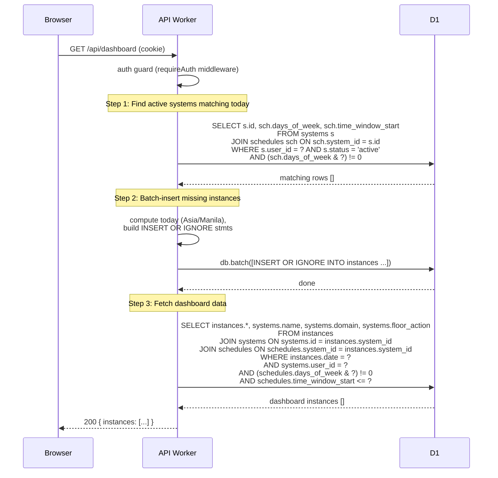
```mermaid
sequenceDiagram
    participant B as Browser
    participant A as API Worker
    participant D as D1

    B->>A: GET /api/dashboard (cookie)
    A->>A: auth guard (requireAuth middleware)

    Note over A: Step 1: Find active systems matching today
    A->>D: SELECT s.id, sch.days_of_week, sch.time_window_start<br/>FROM systems s<br/>JOIN schedules sch ON sch.system_id = s.id<br/>WHERE s.user_id = ? AND s.status = 'active'<br/>AND (sch.days_of_week & ?) != 0
    D-->>A: matching rows []

    Note over A: Step 2: Batch-insert missing instances
    A->>A: compute today (Asia/Manila),<br/>build INSERT OR IGNORE stmts
    A->>D: db.batch([INSERT OR IGNORE INTO instances ...])
    D-->>A: done

    Note over A: Step 3: Fetch dashboard data
    A->>D: SELECT instances.*, systems.name, systems.domain, systems.floor_action<br/>FROM instances<br/>JOIN systems ON systems.id = instances.system_id<br/>JOIN schedules ON schedules.system_id = instances.system_id<br/>WHERE instances.date = ?<br/>AND systems.user_id = ?<br/>AND (schedules.days_of_week & ?) != 0<br/>AND schedules.time_window_start <= ?
    D-->>A: dashboard instances []

    A-->>B: 200 { instances: [...] }
```

**CPU budget analysis:** The entire handler is ~3 SQL queries + 1 `batch()` call. Bitmask matching happens in SQL. No JS loops over result sets. At a few dozen active systems, this is well under 1ms CPU: comfortably within the 10ms ceiling.

### 3.3 Nightly Cron Instance Pre-Generation

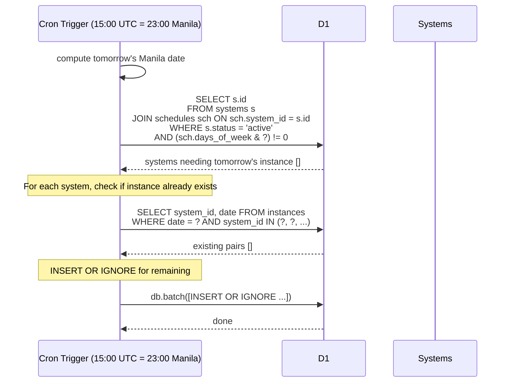
```mermaid
sequenceDiagram
    participant C as Cron Trigger (15:00 UTC = 23:00 Manila)
    participant D as D1
    participant S as Systems

    C->>C: compute tomorrow's Manila date
    C->>D: SELECT s.id<br/>FROM systems s<br/>JOIN schedules sch ON sch.system_id = s.id<br/>WHERE s.status = 'active'<br/>AND (sch.days_of_week & ?) != 0
    D-->>C: systems needing tomorrow's instance []

    Note over C: For each system, check if instance already exists
    C->>D: SELECT system_id, date FROM instances<br/>WHERE date = ? AND system_id IN (?, ?, ...)
    D-->>C: existing pairs []

    Note over C: INSERT OR IGNORE for remaining
    C->>D: db.batch([INSERT OR IGNORE ...])
    D-->>C: done
```

**Idempotency guarantee:** `UNIQUE (system_id, date)` constraint on the `instances` table. Running the Cron job twice for the same date is safe. The lazy dashboard-load path (3.2) is the safety net: if the Cron job silently fails, the user still gets instances the moment they open the dashboard.

### 3.4 Auth Flow

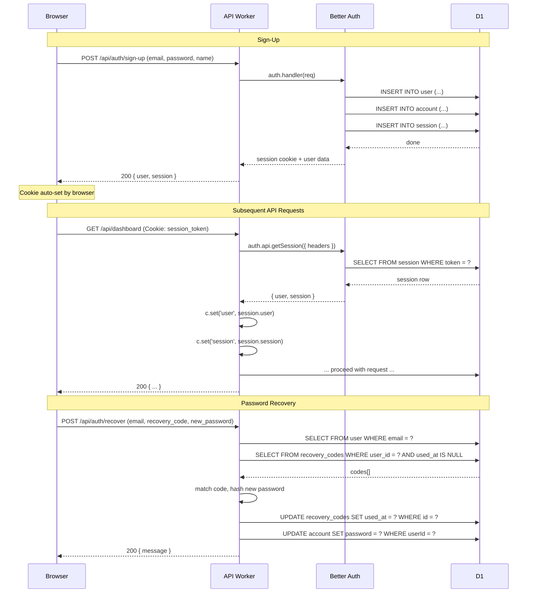
```mermaid
sequenceDiagram
    participant B as Browser
    participant A as API Worker
    participant Auth as Better Auth
    participant D as D1

    Note over B, D: Sign-Up
    B->>A: POST /api/auth/sign-up (email, password, name)
    A->>Auth: auth.handler(req)
    Auth->>D: INSERT INTO user (...)
    Auth->>D: INSERT INTO account (...)
    Auth->>D: INSERT INTO session (...)
    D-->>Auth: done
    Auth-->>A: session cookie + user data
    A-->>B: 200 { user, session }
    Note over B: Cookie auto-set by browser

    Note over B, D: Subsequent API Requests
    B->>A: GET /api/dashboard (Cookie: session_token)
    A->>Auth: auth.api.getSession({ headers })
    Auth->>D: SELECT FROM session WHERE token = ?
    D-->>Auth: session row
    Auth-->>A: { user, session }
    A->>A: c.set('user', session.user)
    A->>A: c.set('session', session.session)
    A->>D: ... proceed with request ...
    A-->>B: 200 { ... }

    Note over B, D: Password Recovery
    B->>A: POST /api/auth/recover (email, recovery_code, new_password)
    A->>D: SELECT FROM user WHERE email = ?
    A->>D: SELECT FROM recovery_codes WHERE user_id = ? AND used_at IS NULL
    D-->>A: codes[]
    A->>A: match code, hash new password
    A->>D: UPDATE recovery_codes SET used_at = ? WHERE id = ?
    A->>D: UPDATE account SET password = ? WHERE userId = ?
    A-->>B: 200 { message }
```

### 3.5 Workspace Widget Data Flow

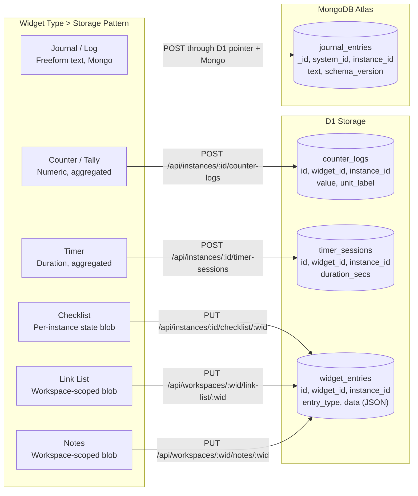
```mermaid
flowchart LR
    subgraph Widgets["Widget Type > Storage Pattern"]
        Counter["Counter / Tally<br/>Numeric, aggregated"]
        Timer["Timer<br/>Duration, aggregated"]
        Checklist["Checklist<br/>Per-instance state blob"]
        LinkList["Link List<br/>Workspace-scoped blob"]
        Notes["Notes<br/>Workspace-scoped blob"]
        Journal["Journal / Log<br/>Freeform text, Mongo"]
    end

    subgraph D1_Storage["D1 Storage"]
        CL[("counter_logs<br/>id, widget_id, instance_id<br/>value, unit_label")]
        TS[("timer_sessions<br/>id, widget_id, instance_id<br/>duration_secs")]
        WE[("widget_entries<br/>id, widget_id, instance_id<br/>entry_type, data (JSON)")]
    end

    subgraph Mongo["MongoDB Atlas"]
        JE[("journal_entries<br/>_id, system_id, instance_id<br/>text, schema_version")]
    end

    Counter -->|"POST /api/instances/:id/counter-logs"| CL
    Timer -->|"POST /api/instances/:id/timer-sessions"| TS
    Checklist -->|"PUT /api/instances/:id/checklist/:wid"| WE
    LinkList -->|"PUT /api/workspaces/:wid/link-list/:wid"| WE
    Notes -->|"PUT /api/workspaces/:wid/notes/:wid"| WE
    Journal -->|"POST through D1 pointer + Mongo"| JE
```

The three storage patterns reflect the nature of the data:
- **Counter + Timer:** Typed numeric columns: needed for SUM/trend queries (Progress chart needs `SELECT SUM(value) FROM counter_logs WHERE widget_id = ? GROUP BY date`).
- **Checklist, Link List, Notes:** JSON blobs in `widget_entries`: variable shaped, never aggregated numerically.
- **Journal:** MongoDB: freeform text, potentially long, and the one genuinely document-shaped feature in the stack.

---

## 4. Storage Strategy

### 4.1 Database Decision Matrix

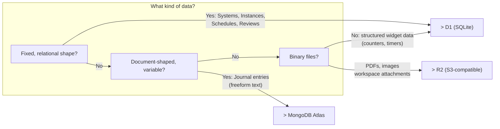
```mermaid
flowchart LR
    subgraph Data["What kind of data?"]
        Q1["Fixed, relational shape?"]
        Q2["Document-shaped, variable?"]
        Q3["Binary files?"]
    end

    Q1 -->|"Yes: Systems, Instances,<br/>Schedules, Reviews"| D1["> D1 (SQLite)"]
    Q1 -->|"No"| Q2
    Q2 -->|"Yes: Journal entries<br/>(freeform text)"| Mongo["> MongoDB Atlas"]
    Q2 -->|"No"| Q3
    Q3 -->|"PDFs, images<br/>workspace attachments"| R2["> R2 (S3-compatible)"]
    Q3 -->|"No: structured widget data<br/>(counters, timers)"| D1
```

### 4.2 D1 Entity-Relationship Diagram

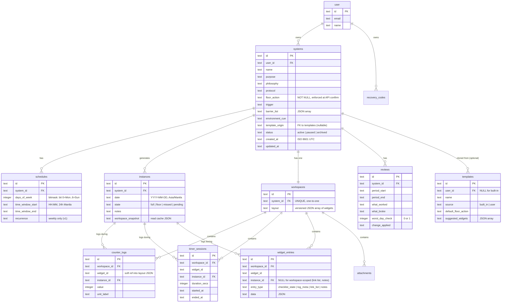
```mermaid
erDiagram
    user ||--o{ systems : "owns"
    user ||--o{ recovery_codes : "owns"
    systems ||--o{ schedules : "has"
    systems ||--o{ instances : "generates"
    systems ||--|| workspaces : "has one"
    systems ||--o{ reviews : "has"
    systems ||--o{ templates : "cloned from (optional)"
    workspaces ||--o{ counter_logs : "contains"
    workspaces ||--o{ timer_sessions : "contains"
    workspaces ||--o{ widget_entries : "contains"
    workspaces ||--o{ attachments : "contains"
    instances ||--o{ counter_logs : "logs during"
    instances ||--o{ timer_sessions : "logs during"
    instances ||--o{ widget_entries : "logs during"

    user {
        text id PK
        text email
        text name
    }

    systems {
        text id PK
        text user_id FK
        text name
        text purpose
        text philosophy
        text protocol
        text floor_action "NOT NULL, enforced at API confirm"
        text trigger
        text barrier_list "JSON array"
        text environment_cue
        text template_origin "FK to templates (nullable)"
        text status "active | paused | archived"
        text created_at "ISO 8601 UTC"
        text updated_at
    }

    instances {
        text id PK
        text system_id FK
        text date "YYYY-MM-DD, Asia/Manila"
        text state "full | floor | missed | pending"
        text notes
        text workspace_snapshot "read cache JSON"
    }

    schedules {
        text id PK
        text system_id FK
        integer days_of_week "bitmask: bit 0=Mon..6=Sun"
        text time_window_start "HH:MM, 24h Manila"
        text time_window_end
        text recurrence "weekly only (v1)"
    }

    reviews {
        text id PK
        text system_id FK
        text period_start
        text period_end
        text what_worked
        text what_broke
        integer worst_day_check "0 or 1"
        text change_applied
    }

    workspaces {
        text id PK
        text system_id FK "UNIQUE, one-to-one"
        text layout "versioned JSON array of widgets"
    }

    templates {
        text id PK
        text user_id FK "NULL for built-in"
        text name
        text source "built_in | user"
        text default_floor_action
        text suggested_widgets "JSON array"
    }

    counter_logs {
        text id PK
        text workspace_id FK
        text widget_id "soft ref into layout JSON"
        text instance_id FK
        integer value
        text unit_label
    }

    timer_sessions {
        text id PK
        text workspace_id FK
        text widget_id
        text instance_id FK
        integer duration_secs
        text started_at
        text ended_at
    }

    widget_entries {
        text id PK
        text workspace_id FK
        text widget_id
        text instance_id FK "NULL for workspace-scoped (link list, notes)"
        text entry_type "checklist_state | log_meta | link_list | notes"
        text data "JSON"
    }
```

### 4.3 MongoDB Document Shape

```json
{
  "_id": ObjectId("64f1a2b3c4d5e6f7a8b9c0d1"),
  "system_id": "sys_a1b2c3",
  "instance_id": "inst_d4e5f6",
  "widget_id": "w_journal1",
  "user_id": "usr_g7h8i9",
  "text": "Finished chapter 3. Slower going than expected...",
  "schema_version": 1,
  "created_at": ISODate("2026-07-01T13:45:00.000Z"),
  "updated_at": ISODate("2026-07-01T13:45:00.000Z")
}
```

All four D1 IDs are **denormalized** onto the Mongo document: no joins back to D1 needed for Mongo queries. The D1-side `widget_entries` row with `entry_type = 'log_meta'` holds a pointer `{"mongo_id": "..."}`, making the seam one-directional.

### 4.4 R2 Attachment Flow

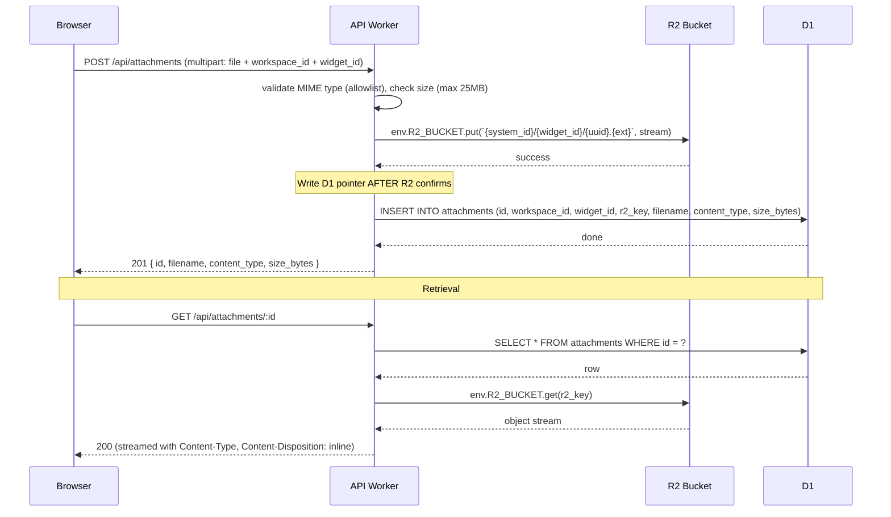
```mermaid
sequenceDiagram
    participant B as Browser
    participant A as API Worker
    participant R as R2 Bucket
    participant D as D1

    B->>A: POST /api/attachments (multipart: file + workspace_id + widget_id)
    A->>A: validate MIME type (allowlist), check size (max 25MB)
    A->>R: env.R2_BUCKET.put(`{system_id}/{widget_id}/{uuid}.{ext}`, stream)
    R-->>A: success
    Note over A: Write D1 pointer AFTER R2 confirms
    A->>D: INSERT INTO attachments (id, workspace_id, widget_id, r2_key, filename, content_type, size_bytes)
    D-->>A: done
    A-->>B: 201 { id, filename, content_type, size_bytes }

    Note over B, D: Retrieval
    B->>A: GET /api/attachments/:id
    A->>D: SELECT * FROM attachments WHERE id = ?
    D-->>A: row
    A->>R: env.R2_BUCKET.get(r2_key)
    R-->>A: object stream
    A-->>B: 200 (streamed with Content-Type, Content-Disposition: inline)
```

---

## 5. Auth Architecture

### 5.1 Better Auth Integration

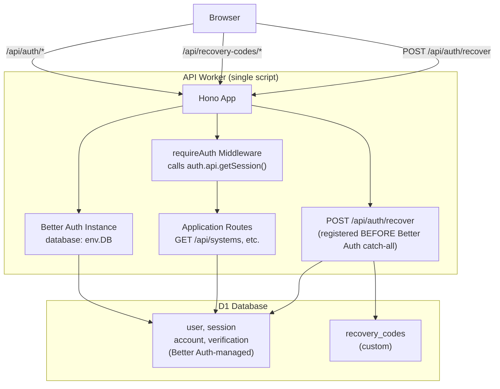
```mermaid
flowchart TB
    subgraph Worker["API Worker (single script)"]
        Hono["Hono App"]
        Auth["Better Auth Instance<br/>database: env.DB"]
        Guard["requireAuth Middleware<br/>calls auth.api.getSession()"]
        Recovery["POST /api/auth/recover<br/>(registered BEFORE Better Auth catch-all)"]
        Routes["Application Routes<br/>GET /api/systems, etc."]
    end

    subgraph D1["D1 Database"]
        AuthTables["user, session<br/>account, verification<br/>(Better Auth-managed)"]
        RecoveryTable["recovery_codes<br/>(custom)"]
    end

    Browser["Browser"] -->|"/api/auth/*"| Hono
    Hono --> Auth
    Auth --> AuthTables

    Browser -->|"/api/recovery-codes/*"| Hono
    Hono --> Guard
    Guard --> Routes
    Routes --> AuthTables

    Browser -->|"POST /api/auth/recover"| Hono
    Hono --> Recovery
    Recovery --> RecoveryTable
    Recovery --> AuthTables
```

### 5.2 Session Cookie Architecture

```
                    paragon.kelpselp.workers.dev (frontend)
                              │
                              │ fetch() + credentials: 'include'
                              │ Cookie: better-auth-session-token=xyz...
                              │
                              ▼
                   Paragon-api.kelpselp.workers.dev (API)
                              │
                              │ Cookie config:
                              │   httpOnly: true
                              │   secure: true (production)
                              │   sameSite: lax
                              │   domain: (unset: defaults to issuing subdomain)
                              │
                              ▼
                    Better Auth validates session
```

**Key design decision:** The frontend and API are on separate `*.workers.dev` subdomains. `sameSite: lax` is required: `strict` would silently break every cross-subdomain request. No explicit `domain` cookie scope is set, because `.workers.dev` is a public suffix and browsers reject cookies scoped to it.

### 5.3 Recovery Codes Flow

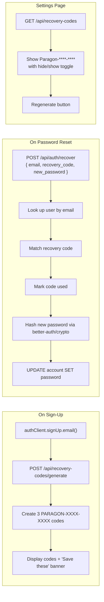
```mermaid
flowchart LR
    subgraph SignUp["On Sign-Up"]
        A1["authClient.signUp.email()"]
        A2["POST /api/recovery-codes/generate"]
        A3["Create 3 PARAGON-XXXX-XXXX codes"]
        A4["Display codes + 'Save these' banner"]
        A1 --> A2 --> A3 --> A4
    end

    subgraph Recovery["On Password Reset"]
        B1["POST /api/auth/recover<br/>{ email, recovery_code, new_password }"]
        B2["Look up user by email"]
        B3["Match recovery code"]
        B4["Mark code used"]
        B5["Hash new password via better-auth/crypto"]
        B6["UPDATE account SET password"]
        B1 --> B2 --> B3 --> B4 --> B5 --> B6
    end

    subgraph Settings["Settings Page"]
        C1["GET /api/recovery-codes"]
        C2["Show Paragon-****-****<br/>with hide/show toggle"]
        C3["Regenerate button"]
        C1 --> C2 --> C3
    end
```

Codes are stored plaintext in D1 (`recovery_codes` table) so the settings page can display them. The recovery route is registered **before** Better Auth's catch-all handler, ensuring it's reachable without authentication (the user is locked out by definition when they need it).

---

## 6. API Design

### 6.1 Route Inventory

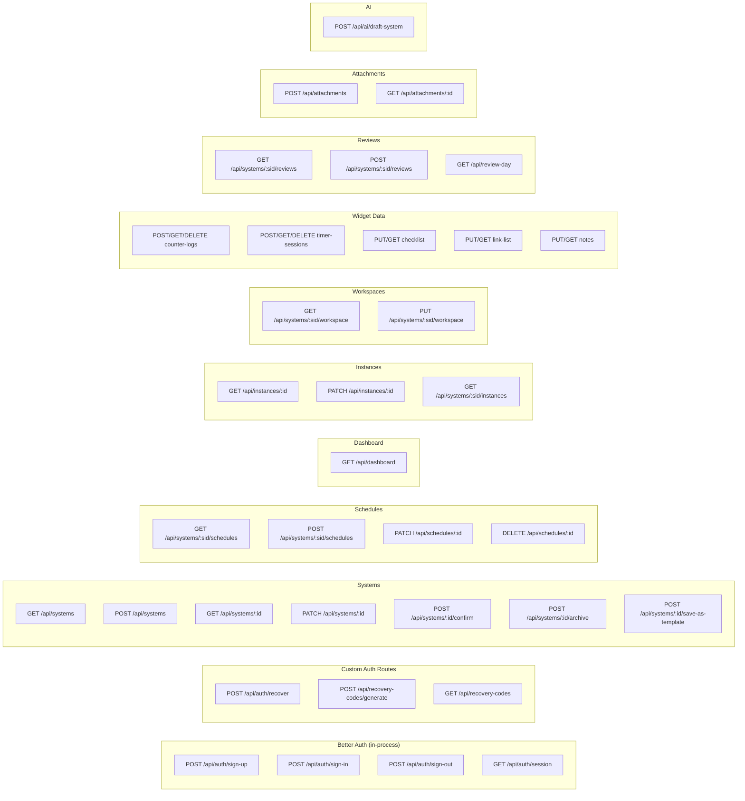
```mermaid
flowchart LR
    subgraph Auth["Better Auth (in-process)"]
        SignUp["POST /api/auth/sign-up"]
        SignIn["POST /api/auth/sign-in"]
        SignOut["POST /api/auth/sign-out"]
        Session["GET /api/auth/session"]
    end

    subgraph Custom["Custom Auth Routes"]
        Recover["POST /api/auth/recover"]
        GenCodes["POST /api/recovery-codes/generate"]
        GetCodes["GET /api/recovery-codes"]
    end

    subgraph Systems["Systems"]
        List["GET /api/systems"]
        Create["POST /api/systems"]
        Get["GET /api/systems/:id"]
        Patch["PATCH /api/systems/:id"]
        Confirm["POST /api/systems/:id/confirm"]
        Archive["POST /api/systems/:id/archive"]
        SaveTmpl["POST /api/systems/:id/save-as-template"]
    end

    subgraph Schedules["Schedules"]
        ListSch["GET /api/systems/:sid/schedules"]
        CreateSch["POST /api/systems/:sid/schedules"]
        PatchSch["PATCH /api/schedules/:id"]
        DelSch["DELETE /api/schedules/:id"]
    end

    subgraph Dashboard["Dashboard"]
        Dash["GET /api/dashboard"]
    end

    subgraph Instances["Instances"]
        GetInst["GET /api/instances/:id"]
        PatchInst["PATCH /api/instances/:id"]
        ListInst["GET /api/systems/:sid/instances"]
    end

    subgraph Workspaces["Workspaces"]
        GetWS["GET /api/systems/:sid/workspace"]
        PutWS["PUT /api/systems/:sid/workspace"]
    end

    subgraph Widgets["Widget Data"]
        Counter["POST/GET/DELETE counter-logs"]
        Timer["POST/GET/DELETE timer-sessions"]
        Checklist["PUT/GET checklist"]
        LinkList["PUT/GET link-list"]
        Notes["PUT/GET notes"]
    end

    subgraph Reviews["Reviews"]
        ListRev["GET /api/systems/:sid/reviews"]
        CreateRev["POST /api/systems/:sid/reviews"]
        RevDay["GET /api/review-day"]
    end

    subgraph Attachments["Attachments"]
        Upload["POST /api/attachments"]
        Download["GET /api/attachments/:id"]
    end

    subgraph AI["AI"]
        Draft["POST /api/ai/draft-system"]
    end
```

### 6.2 Ownership Chain

Every resource ultimately belongs to a user through the ownership chain:

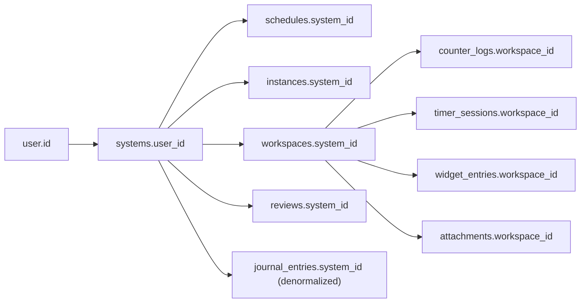
```mermaid
flowchart LR
    User["user.id"] --> System["systems.user_id"]
    System --> Schedule["schedules.system_id"]
    System --> Instance["instances.system_id"]
    System --> Workspace["workspaces.system_id"]
    System --> Review["reviews.system_id"]
    Workspace --> Counter["counter_logs.workspace_id"]
    Workspace --> Timer["timer_sessions.workspace_id"]
    Workspace --> WEntry["widget_entries.workspace_id"]
    Workspace --> Attachment["attachments.workspace_id"]
    System --> Mongo["journal_entries.system_id (denormalized)"]
```

The `requireAuth` middleware sets `c.get('user').id`. Every route handler reads this value and joins back to `systems.user_id`: never trusting the resource's own `id` alone. A row that exists but belongs to a different user returns `404`, indistinguishable from "not found."

### 6.3 Instance State Machine

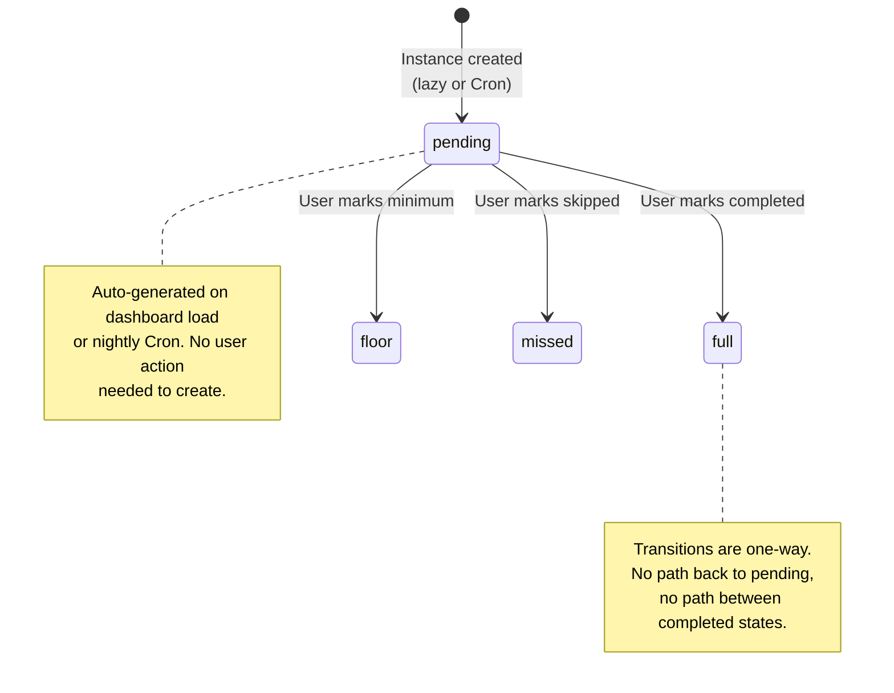
```mermaid
stateDiagram-v2
    [*] --> pending : Instance created<br/>(lazy or Cron)
    pending --> full : User marks completed
    pending --> floor : User marks minimum
    pending --> missed : User marks skipped

    note right of pending
        Auto-generated on dashboard load
        or nightly Cron. No user action
        needed to create.
    end note

    note right of full
        Transitions are one-way.
        No path back to pending,
        no path between completed states.
    end note
```

The state machine is deliberately simple: one direction, no "unmark" path. This enforces the product philosophy that past instances reflect reality: a missed day stays missed even if you later do the work.

### 6.4 Pagination Design

```
Request:
    GET /api/systems?limit=50&cursor=base64... 

Response:
    {
      "systems": [ ... ],
      "next_cursor": "base64..."  // null on last page
    }
```

Cursor format: `base64(json({"d":"2026-07-01T12:00:00.000Z","i":"<last_uuid>"}))` for date-sorted lists, `base64(json({"n":"Reading System","i":"<last_uuid>"}))` for name-sorted lists. The cursor is opaque to the frontend: the server decodes and uses it for `WHERE sort_col > ?` queries.

---

## 7. Frontend Architecture

### 7.1 CSR-Only Approach

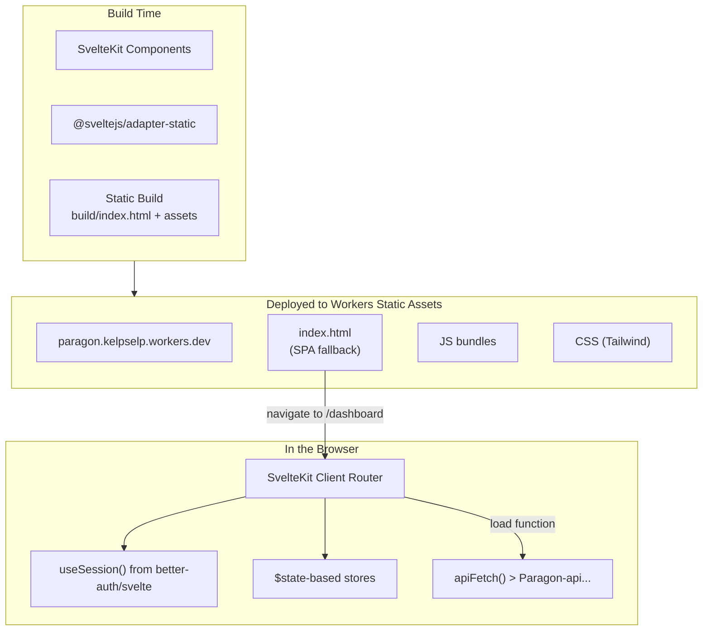
```mermaid
flowchart TB
    subgraph Build["Build Time"]
        Svelte["SvelteKit Components"]
        Adapter["@sveltejs/adapter-static"]
        BuildOut["Static Build<br/>build/index.html + assets"]
    end

    subgraph Deploy["Deployed to Workers Static Assets"]
        Assets["paragon.kelpselp.workers.dev"]
        Index["index.html<br/>(SPA fallback)"]
        JS["JS bundles"]
        CSS["CSS (Tailwind)"]
    end

    subgraph Runtime["In the Browser"]
        Router["SvelteKit Client Router"]
        Auth["useSession() from better-auth/svelte"]
        Stores["$state-based stores"]
        API["apiFetch() > Paragon-api..."]
    end

    Build --> Deploy
    Index -->|"navigate to /dashboard"| Router
    Router -->|"load function"| API
    Router --> Auth
    Router --> Stores
```

**SSR is disabled** (`export const ssr = false` at root layout). The frontend is pure static files: zero Worker invocation for page loads. This is the most effective way to stay within the 10ms CPU budget: the frontend can't consume CPU time it never runs on.

### 7.2 Route Tree

```
src/routes/
├── +layout.ts                    ssr=false, prerender=false
├── +layout.svelte                renders <slot/>: no chrome
│
├── (marketing)/
│   └── +page.svelte              /: Landing page, pre-auth only
│
├── (auth)/                       Pre-auth: centered form layout
│   ├── +layout.svelte            Redirects signed-in users to /guides
│   ├── sign-up/+page.svelte
│   └── sign-in/+page.svelte
│
└── (app)/                        Post-auth: nav shell + auth guard
    ├── +layout.ts                Guards: redirects to /sign-in if no session
    ├── +layout.svelte            NavBar + ToastContainer + <slot/>
    ├── guides/+page.svelte       Guides & Tutorials tab
    ├── dashboard/+page.svelte    Daily execution view
    ├── systems/
    │   ├── +page.svelte          System list
    │   ├── new/+page.svelte      System Creator (form)
    │   └── [id]/
    │       ├── +layout.ts        Loads system data once, shared by tabs
    │       ├── +page.svelte      Overview tab
    │       ├── edit/+page.svelte Edits (reuses Creator form)
    │       ├── workspace/+page.svelte  Widget canvas
    │       └── reviews/new/+page.svelte  Review form
    └── review-day/+page.svelte   Aggregated review view
```

Route groups (parenthesized) apply different layouts without changing the URL:
- `(marketing)`: no chrome, no auth check
- `(auth)`: centered minimal form layout, redirects signed-in users away
- `(app)`: sidebar nav shell, redirects to sign-in if no session

### 7.3 Store Pattern: Optimistic Updates

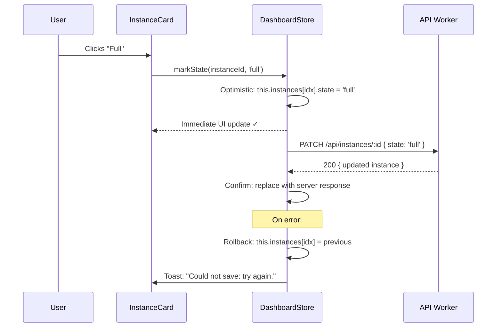
```mermaid
sequenceDiagram
    participant U as User
    participant C as InstanceCard
    participant S as DashboardStore
    participant A as API Worker

    U->>C: Clicks "Full"
    C->>S: markState(instanceId, 'full')
    S->>S: Optimistic: this.instances[idx].state = 'full'
    S-->>C: Immediate UI update ✓
    S->>A: PATCH /api/instances/:id { state: 'full' }
    A-->>S: 200 { updated instance }
    S->>S: Confirm: replace with server response

    Note over S: On error:
    S->>S: Rollback: this.instances[idx] = previous
    S->>C: Toast: "Could not save: try again."
```

This pattern is used by `DashboardStore`: the most frequent interaction in the app. The UI updates instantly, then reconciles with the server. If the server fails, the UI rolls back and shows a toast.

### 7.4 Component Hierarchy

```
Dashboard Page
├── +page.ts               > GET /api/dashboard > dashboardStore.load()
└── InstanceList
    └── InstanceCard[]
        ├── SystemBadge (domain, floor_action)
        ├── StateButtons (full / floor / missed)
        └── WorkspaceLink

System Creator Page
├── TemplatePicker         > GET /api/templates
├── AIDraftPanel           > POST /api/ai/draft-system
└── SystemForm (autosaves via debounced PATCH)
    ├── Purpose, Philosophy, Protocol
    ├── Floor Action, Trigger
    ├── Barrier List, Environment Cue
    ├── Schedule (days + time window)
    └── ConfirmButton > POST /api/systems/:id/confirm

Workspace Builder Page
├── WidgetPalette          > Add widgets from catalog
├── WorkspaceCanvas (svelte-dnd-action)
│   └── WidgetCard[] (dispatched by type)
│       ├── TimerWidget
│       ├── CounterWidget
│       ├── ChecklistWidget
│       ├── LogWidget (Mongo-backed)
│       ├── LinkListWidget
│       ├── StreakWidget (read-only)
│       ├── ProgressChartWidget (read-only)
│       └── NotesWidget
└── SaveBar                > PUT /api/systems/:id/workspace
```

---

## 8. Scheduling & Background Jobs

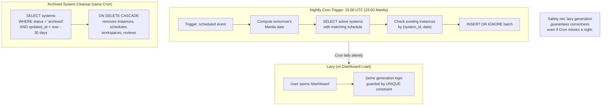
```mermaid
flowchart TB
    subgraph Nightly["Nightly Cron Trigger: 15:00 UTC (23:00 Manila)"]
        Start["Trigger: scheduled event"]
        Compute["Compute tomorrow's<br/>Manila date"]
        Query["SELECT active systems<br/>with matching schedule"]
        Filter["Check existing instances<br/>by (system_id, date)"]
        Batch["INSERT OR IGNORE batch"]
        Start --> Compute --> Query --> Filter --> Batch
    end

    subgraph Lazy["Lazy (on Dashboard Load)"]
        DashLoad["User opens /dashboard"]
        DashGen["Same generation logic<br/>guarded by UNIQUE constraint"]
        DashLoad --> DashGen
    end

    subgraph Cleanup["Archived System Cleanup (same Cron)"]
        FindArch["SELECT systems<br/>WHERE status = 'archived'<br/>AND updated_at < now - 30 days"]
        Cascade["ON DELETE CASCADE<br/>removes instances, schedules,<br/>workspaces, reviews"]
        FindArch --> Cascade
    end

    Nightly -->|"Cron fails silently"| Lazy
    Note["Safety net: lazy generation<br/>guarantees correctness<br/>even if Cron misses a night."]
```

### Trigger Timezone Handling

```
Manila timezone: Asia/Manila (UTC+8, no DST)
Cron expression: 0 15 * * *  (15:00 UTC = 23:00 Manila)

All dates stored in D1: ISO 8601 UTC strings
API boundary: converts to/from Asia/Manila
"Today" is computed server-side as Manila calendar date
```

The no-DST property of the Philippines timezone means the UTC offset is permanently stable: no twice-yearly clock-change edge cases. The Cron expression never needs seasonal adjustment.

---

## 9. Key Trade-offs & Decisions

| Decision | Chosen | Alternatives Considered |
|---|---|---|
| **Frontend framework** | SvelteKit (CSR) | Next.js (already known: no learning), Qwik/Astro (core advantage doesn't apply to logged-in app) |
| **Backend framework** | Hono (TypeScript) | `workers-rs` (Rust: too much risk for MVP), Express (not Worker-native) |
| **Primary database**  | D1 (SQLite via Cloudflare) | MongoDB as primary (structured data fits SQL better; Atlas adds latency), Supabase (another account to manage) |
| **Secondary database** | MongoDB Atlas (one collection) | D1 TEXT column for journal entries (potentially long text), no secondary DB (loses learning goal) |
| **Auth** | Better Auth (self-hosted) | Clerk (requires custom domain, incompatible with `workers.dev`), Lucia (deprecated), roll-your-own (high time cost) |
| **Rendering** | CSR-only (static assets) | SSR (burns 10ms CPU budget on every page load), SSG (no dynamic data without client fetch) |
| **File uploads** | Proxied through Worker | R2 presigned URLs (requires S3-compatible API + credentials, unnecessary complexity at personal scale) |
| **Journal retry** | Cloudflare Queues | Direct write with no retry ("capture beats perfection" violated), client-side retry (unreliable) |
| **Schedule encoding** | Bitmask integer (0-127) | JSON array of day names (not queryable in SQL), 7 boolean columns (over-normalized) |
| **Time zone** | Hardcoded Asia/Manila | Per-user timezone config (unnecessary for a single-user tool in the Philippines) |
| **Pagination** | Cursor-based from v1 | Offset-based (inconsistent for ordered lists), deferred (would require rewiring all `apiFetch` call sites) |

### How the 10ms CPU Constraint Shapes Every Decision

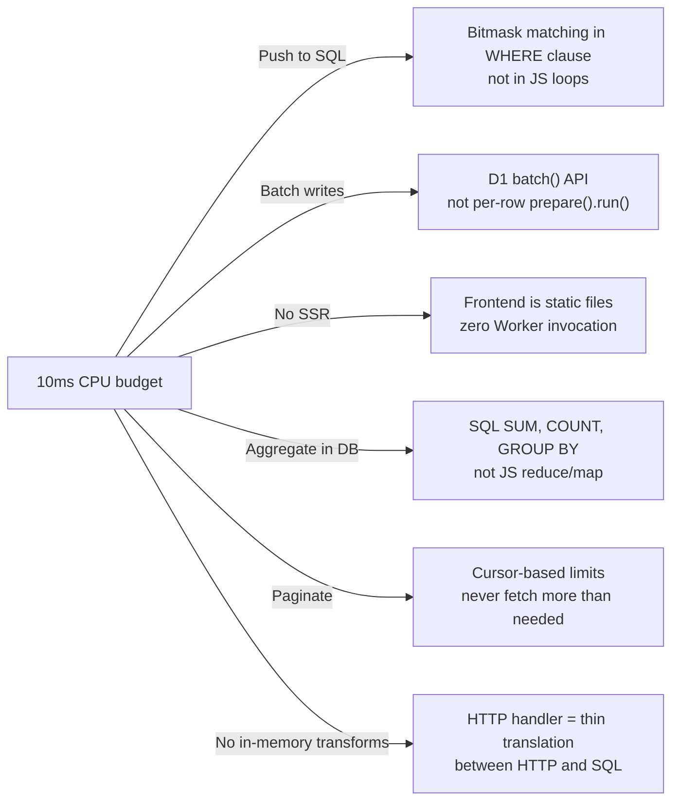
```mermaid
flowchart LR
    C10["10ms CPU budget"] -->|"Push to SQL"| A["Bitmask matching in WHERE clause<br/>not in JS loops"]
    C10 -->|"Batch writes"| B["D1 batch() API<br/>not per-row prepare().run()"]
    C10 -->|"No SSR"| C["Frontend is static files<br/>zero Worker invocation"]
    C10 -->|"Aggregate in DB"| D["SQL SUM, COUNT, GROUP BY<br/>not JS reduce/map"]
    C10 -->|"Paginate"| E["Cursor-based limits<br/>never fetch more than needed"]
    C10 -->|"No in-memory transforms"| F["HTTP handler = thin translation<br/>between HTTP and SQL"]
```

Every route handler in the API is designed against this constraint. The most critical path: Dashboard load: uses 3 SQL queries and 1 batch call, with bitmask matching pushed into SQL. At a few dozen active systems, this stays well under 1ms CPU.

---

## 10. Deployment & CI/CD

### 10.1 Deploy Pipeline

```mermaid
flowchart LR
    subgraph Repo["GitHub: main branch"]
        Code["Source code"]
        ADRs["Docs"]
    end

    subgraph CI["CI (manual deploy)"]
        Install["pnpm install"]
        Migrate["wrangler d1 migrations apply"]
        Test["pnpm -r test"]
        Build["Build SvelteKit SPA"]
        Deploy["pnpm -r deploy"]
    end

    subgraph Production["Cloudflare"]
        Web["Workers Static Assets<br/>paragon.kelpselp.workers.dev"]
        API["Worker<br/>Paragon-api.kelpselp.workers.dev"]
        D1_Prod["D1 Database<br/>(production binding)"]
    end

    subgraph Dev["Local Development"]
        Vite["Vite dev server<br/>localhost:5173"]
        Wrangler["wrangler dev<br/>localhost:8787"]
        D1_Local["D1 (local SQLite)"]
        Mongo_Local["MongoDB container<br/>localhost:27017"]
    end

    Code --> Install --> Migrate --> Test --> Build --> Deploy
    Deploy --> Web
    Deploy --> API
    Migrate --> D1_Prod

    Vite -->|"/api/* proxy"| Wrangler
    Wrangler --> D1_Local
    Wrangler --> Mongo_Local
```

### 10.2 Free-Tier Ceilings

| Service | Free Tier Limit | Expected Usage |
|---|---|---|
| Workers | 100k requests/day, 10ms CPU/invocation | Hundreds/day at most |
| D1 | 5 GB storage, 5M rows read/day, 100k writes/day | ~1k rows/year per user |
| R2 | 10 GB-month storage, 1M Class A ops/month | MBs of attachments |
| Queues | 10k operations/day | < 10/day (journal retries) |
| Workers AI | 10k Neurons/day | ~60-120 Neurons per AI assist call |
| MongoDB Atlas | 512 MB storage (free tier) | KBs of journal text |
| Cron Triggers | 5 triggers per account (free) | 1 trigger used |

All services are comfortably within their free-tier limits for a personal app. The most constrained is **Workers CPU (10ms)**, which is the design axis every server-side decision optimizes for.

### 10.3 Environment Configuration

| Variable | Dev Value | Production Value |
|---|---|---|
| `VITE_API_BASE_URL` | `''` (same-origin via Vite proxy) | `https://Paragon-api.kelpselp.workers.dev` |
| `MONGODB_URI` | `mongodb://localhost:27017/Paragon` | Atlas cluster connection string (via `wrangler secret`) |
| `BETTER_AUTH_SECRET` | Dev secret (local) | Production secret (via `wrangler secret`) |
| `BETTER_AUTH_URL` | `http://localhost:8787` | `https://Paragon-api.kelpselp.workers.dev` |

---

> **Further reading:**
> - [Tech Stack ADR](ADRs/001-tech-stack-adr.md): full rationale for every technology choice
> - [D1 Schema ADR](ADRs/002-d1-schema.md): all table definitions, indexes, and constraints
> - [MongoDB Schema ADR](ADRs/003-mongodb-schema.md): journal entries collection
> - [PRD](PRD/PRD-systems-app.md): feature scope, user flows, success metrics
> - [API Route Design](reference/api-routes.md): every endpoint contract with request/response shapes
> - [Auth Integration](reference/auth-integration.md): Better Auth wiring, recovery codes, CSRF
> - [SvelteKit Route Architecture](reference/sveltekit-route-architecture.md): frontend route tree, stores, components
> - [Testing Strategy](reference/testing-strategy.md): integration, unit, and E2E test design
> - [Security Review](reference/security-review.md): threat model, attachment MIME validation, CSP
